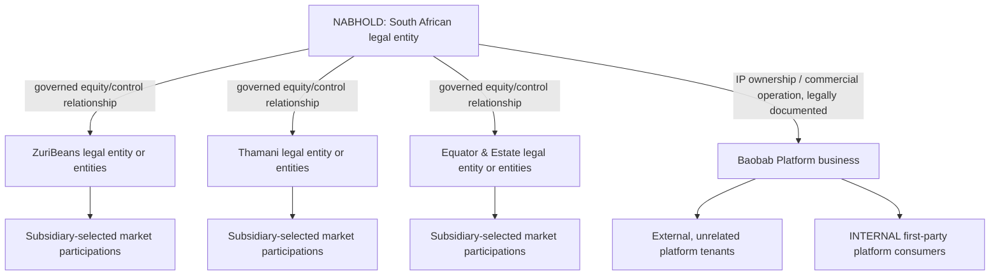
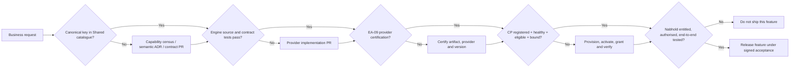
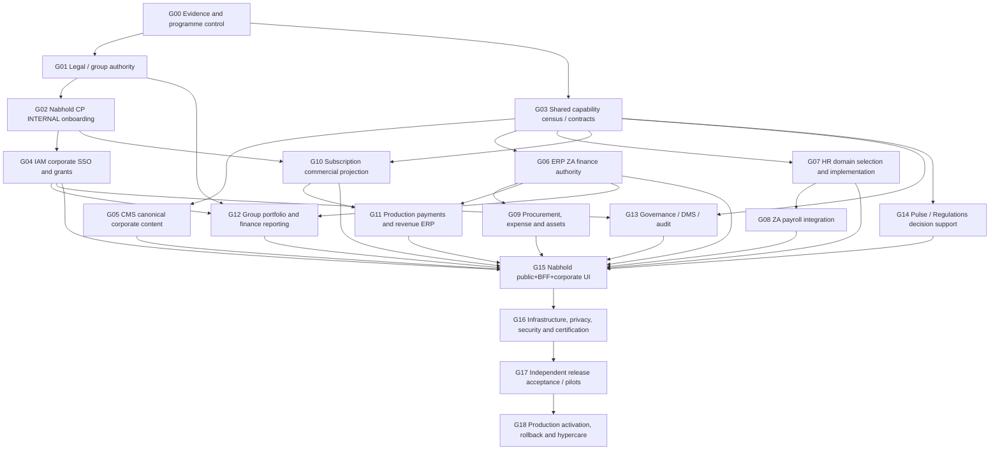
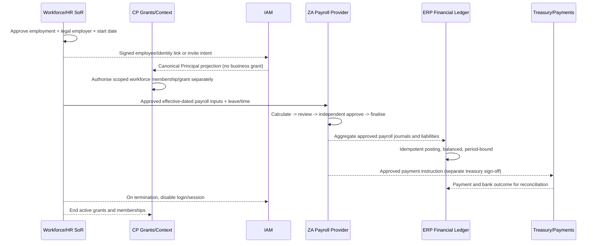
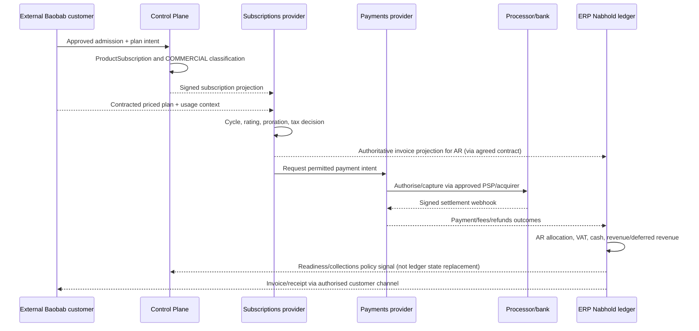
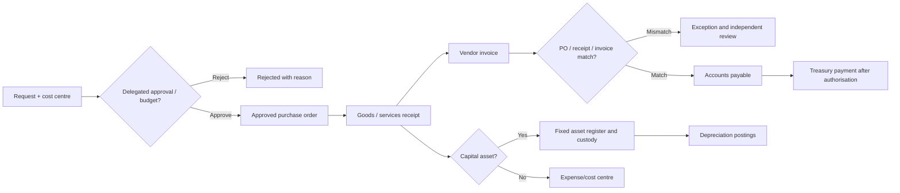
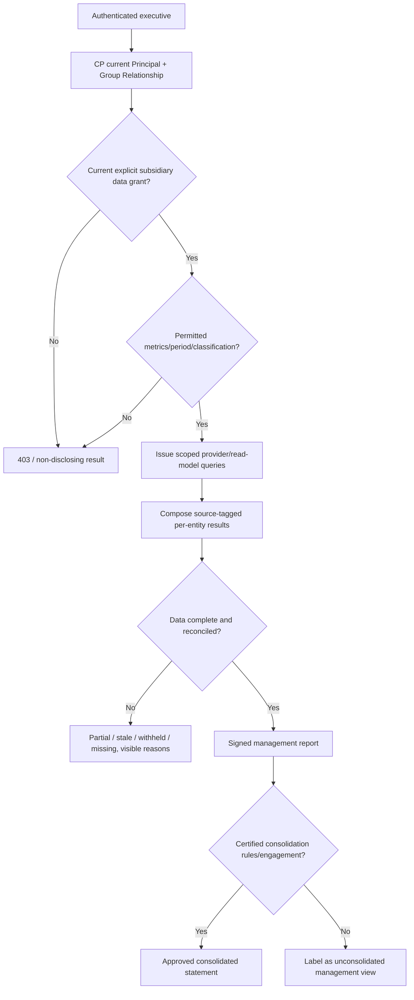
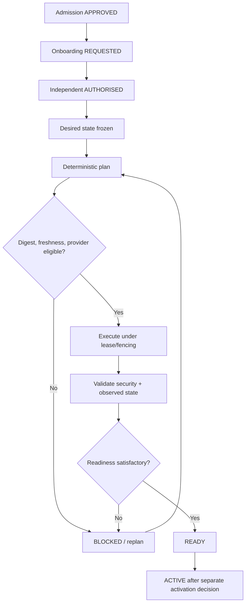

# NABHOLD GROUP AFRICA
## Corporate Digital Estate & Baobab Platform Commercialisation — Go-Live Masterplan

**Document ID:** NAB-GOLIVE-MP-001  
**Version:** 1.0 — proposed baseline for formal approval  
**Baseline date:** 8 October 2026  
**Authority:** Nabhold Group Africa corporate sponsor, subject to acceptance of repository-specific ADRs and legal/financial sign-off  
**Primary implementation repository:** [`baobab-platform/nabhold`](https://github.com/baobab-platform/nabhold)  
**Platform architecture/contract authority:** [`baobab-platform/shared`](https://github.com/baobab-platform/shared)  
**Tenancy/entitlement authority:** [`baobab-platform/baobab-cp`](https://github.com/baobab-platform/baobab-cp)  
**Status:** DRAFT FOR ARCHITECTURAL RATIFICATION — not a claim that any gate is complete  
**Baseline convention:** `EVIDENCED` = implementation seen in source/declaration; `DECLARED` = canonical contract only; `PLANNED` = proposal not yet canonically registered; `UNVERIFIED` = no acceptance evidence; `BLOCKED` = required prerequisite absent. **Neither source code nor a green CI test establishes a production-active CapabilityBinding.**

> **Master rule:** This document is the *programme reference* for Nabhold go-live, not an alternative source of canonical contracts, runtime permissions, financial truth or legal advice. Accepted Shared, Control Plane and engine ADRs govern their own domains. Any contradiction is a blocking decision to reconcile through an ADR and contract PR, not an invitation for Nabhold frontend code to invent a workaround.

---

# 1. Mission, scope and final operating model

## 1.1 Mission

Develop Nabhold Group Africa's corporate digital estate into one independently deployable, professional public corporate experience and a protected, business-operated corporate workspace. It must support: portfolio and subsidiary oversight; internal South African finance; HR and payroll; group procurement; assets; budgets/projects; corporate governance; group performance reporting; and Nabhold's sale, support and accounting of subscriptions to Baobab Platform. It must consume governed capabilities from Baobab engines through the existing platform resolution model.

## 1.2 Corporate identity and mandatory boundaries

| Topic | Governed requirement | Does **not** imply |
|---|---|---|
| Nabhold corporate entity | South African holding company and Baobab IP/platform owner/operator; organisational operating market ZA | That Baobab cloud infrastructure or all customers must be in ZA |
| Subsidiary autonomy | Each subsidiary controls its market participation, day-to-day commercial decisions, legal compliance and operational data | That parents lack board-level reserved matters or approved reporting rights |
| Corporate trading | Nabhold does not buy/sell subsidiary goods as its business model | That Nabhold cannot purchase business inputs, invoice SaaS/services or receive royalties |
| Nabhold platform revenue | It contracts for Baobab subscriptions/licences/services under approved terms | That browser or CP can invent monetary ledger entries |
| Nabhold tenancy | Independent corporate consumer; INTERNAL subscription subject to normal metering, isolation, readiness and audit | A wildcard tenant or direct database access |
| Subsidiary tenancy | Each subsidiary separately registered with legal-entity mapping and its own subscriptions, contexts, grants and market permissions | That each legal entity is permanently one tenant or that a group is a tenant |
| Group oversight | Authority-scoped reporting across an effective-dated ownership graph | Automatic access to payroll, raw customer records or another tenant's private data |
| Frontend | Experience, approved BFF compositions and presentation models | A new ERP, IAM, accounting service, DMS, governance SoR or event broker |

**No synthetic group-wide tenant ID, no `tenant=*`, no `legal_entity=*`, and no direct privilege derived from a corporate graph edge.** Group access requires the authenticated actor, current corporate relationship, explicit administrative/portfolio scope, capability entitlement, domain authorisation, data-classification clearance and the reason/purpose of use.

## 1.3 Three independently releasable products

| Release class | Product | Users | Operational go-live condition |
|---|---|---|---|
| **R0 — Institutional** | Public corporate website: homepage, group profile, portfolio, sectors, insights, contacts, policies | Public | Correct content, secure publishing/caching, legal approval, accessibility, operations |
| **R1 — Corporate** | Protected workplace: identity, own-entity finance, HR/payroll, procurement/assets, corporate documents, approvals | Employees, finance, HR, corporate executives | Real IAM, authorisation, at least one certified operational provider for every compulsory function, reconciled books and payroll controls |
| **R2 — Platform commercial** | Customer portfolio, plans, trials, subscriptions, invoices, usage, collections, support, revenue/settlement | Baobab commercial administrators, finance, support | Real billing+payments+ERP financial chain, tax and contract controls, independent production proof |
| **R3 — Group oversight** | Group portfolio, approved subsidiary performance, consolidation, intelligence, capital allocation and reserved matters | Scoped directors/executives/analysts | Approved reporting agreements, signed definitions, data lineage, audit and subsidiary autonomy negative tests |

These releases may overlap in development. They may **not** be declared ready by inference from another release. R0 can proceed without payroll. R2 cannot process money using simulated providers. R3 must not label a calculated sum as a consolidated financial statement without accountant-approved accounting and eliminations.

## 1.4 Reference architecture

```mermaid
flowchart TB
    U[Public user] --> PUB[Nabhold public Next.js routes]
    X[Employee / director / operator] --> IAM[Baobab IAM: OIDC, federation, assurance]
    IAM --> BFF[Nabhold protected Next.js BFF / RSC]
    PUB --> BFFP[Public content composition]
    BFFP --> CP[Control Plane context / capability resolution]
    BFF --> CP
    CP --> G[(Grants, subscriptions, bindings, trust, residency, readiness)]
    CP -. resolution result, not business proxy .-> BFF
    CP -. public resolution .-> BFFP
    BFF --> ERP[ERP: finance / AP / AR / P2P / assets]
    BFF --> PEOPLE[Workforce: HR and leave]
    BFF --> PAYROLL[Approved ZA payroll provider]
    BFF --> SUB[Subscriptions: billing]
    BFF --> PAY[Payments: collection and settlement]
    BFF --> CMS[CMS: editorial content]
    BFF --> PULSE[Pulse: evidence / research]
    BFF --> REG[Regulations: regulatory assessment]
    BFFP --> CMS
    ERP --> EVT[Canonical contracts / events / evidenced read models]
    SUB --> EVT
    PAY --> EVT
    PEOPLE --> EVT
    PAYROLL --> EVT
    EVT --> PULSE
    subgraph Subsidiary tenants, independently governed
      Z[ZuriBeans]
      T[Thamani]
      E[Equator & Estate]
    end
    Z --> CP
    T --> CP
    E --> CP
    EVT -. approved projections only .-> BFF
```

**Invocation:** CP answers *who/what/where/under which permitted binding*, not every business query. BFF invokes authorised providers on the data plane, using short-lived scoped credentials or assertion patterns established by Shared/IAM. CP never becomes a universal business API proxy. The frontend does not keep an independent canonical portfolio database or privileged token in the browser.

## 1.5 Organisational/legal hierarchy



Diagram is a target logical view, not proof of incorporation, ownership percentages, signed IP assignments, or subsidiary market admission. Each edge must be supported by authoritative evidence, effective dates and a valid CP relationship. A subsidiary sale or exit terminates future group privileges without erasing historical financial/audit records.

# 2. Evidence baseline — observed versus unproven

## 2.1 Repositories at inspected default-branch revisions

| Repository | Inspected main commit | Important baseline |
|---|---|---|
| nabhold | `9336d49dfd4cabcb4bf894b81d3835c5edc3301e` | Public site, CMS adapter, Pulse-only prototype dashboard, preview session |
| shared | `70f92ee179888e9fd38e31ae9225060d76833944` | Canonical capability catalogue and platform contracts |
| baobab-cp | `897cc6c9df11adc60c7a567b1cba290d820c0683` | Admission/group/context/provisioning, administrative and operational layers under development |
| baobab-iam | `cef8d0210f128352b2d3a264f349e5c12e646d4d` | Kratos/Hydra/Keycloak provider-neutral programme, PARTIAL provider declaration |
| baobab-cms | `19deac119b3232ccbf29f1889b62cfabb43ceeb1` | Payload implementation; canonical content entry resolution CONTRACTED, not published as provider support |
| baobab-erp | `416995b3574b0a1ae9a036697be3741db9c4c68c` | iDempiere adapters, context/inventory/order-consequence work; corporate business functions incomplete |
| baobab-subscriptions | `631093cb52e3cf1699be46787c2bdb40dc301ed6` | Simulated temporary billing provider only |
| baobab-payments | `017adeec1f827d03f29fbf6601280fbc7856373b` | Sandbox payment provider only |
| baobab-pulse | `a04ac796d8ba61a2b15d7534f805d5c29974b0b0` | Evidence search and research mission IMPLEMENTED, not proved active for Nabhold |
| baobab-regulations | `4fab60ef52ab0661901db2814fa0ab661bdbc369` | Three narrow capability surfaces PARTIAL |
| baobab-trade | `78d16b84379448aada6d5eab583c7eb8c2a4b7f5` | Trade capability declarations planned-only |
| infrastructure | `48ff6272db06143fe7418453770a3730cf3061b7` | Staging/deployment programme; production cloud/account prerequisites require independent proof |
| zuribeans | `a03690116ce5cd4727e5fe8284996a97e479a3f3` | Independently operated subsidiary estate |
| thamani | `8dd76e97a358e3aeb27e7b9d27f6f2177a5bd2c3` | Independently operated subsidiary estate |
| equator-estate | `5c43dcedc6f43cd2f9cafdecb446f2decca3cac5` | Independently operated subsidiary estate |

This is a snapshot, **not** a claim of future currency. Each gate rechecks current main, open PRs, contracts.lock and production execution evidence. Source links: all repositories follow `https://github.com/baobab-platform/<repository>`.

## 2.2 Nabhold existing assets and defects

| Asset / target | Actual evidence | Decision |
|---|---|---|
| `src/app/(public)` | Public routes for about, group, portfolio, sectors, insights and sign-in | Retain and harden |
| `src/app/(dashboard)` | Executive overview and protected layout | Rebuild feature breadth incrementally; preserve route separation |
| `src/lib/content/gateway.ts` | Abstract corporate content port | Retain; replace static provider choice with CP-resolved invocation |
| `src/integrations/payload/` | Payload-specific REST adapter and DTOs, CMS data fallbacks | Transitional only; map to canonical contract, no public production data fabrication |
| `src/lib/pulse/client.ts` | Calls `GET /v1/executive-overview` through a static Pulse URL/token | Not an approved canonical Pulse capability; do not claim provider readiness; replace with existing canonical evidence/research or contract a new executive summary capability |
| `src/lib/auth/session.ts` | Only returns session under `NABHOLD_DASHBOARD_PREVIEW=true`, throws in production if preview enabled | Real OIDC/BFF session missing, release blocker |
| `src/app/(public)/sign-in/page.tsx` | Explicitly states federation is not connected | Real sign-in is prerequisite for protected R1-R3 |
| `package.json` | Next `15.5.24`, Node `>=22 <23`, pnpm `11.24.0` | Intentionally decide/test Node 24 standard alignment and Next upgrade; do not force upgrade or assume runtime parity |
| `.devcontainer` | baobab-dev `1.4.4-frontend` | Preserve reproducible profile with SHA/digest and CI evidence |
| `.github/workflows/ci.yml` | Lint/typecheck/unit/build/Playwright | Extend security/contract/acceptance gates; no CI-only go-live claim |
| Nabhold ADRs 0001–0011 | Accepted and detailed authority boundaries | Retain; append the corporate operational and go-live decisions described in §9 |
| First-party Shared registry | `NABHOLD` holding-company record and ERP consumption intent | Reconcile verified ZA registration evidence; do not equate intent with ACTIVE tenant |

Observed on 8 October 2026: ERP PR [`#58`](https://github.com/baobab-platform/baobab-erp/pull/58) is **open** and proposes provider declaration for inventory (IMPLEMENTED) and order-consequence (PARTIAL). Treat branch evidence separately from ERP main. ERP's 8 October additional-area census says no full procurement, assets, workforce, attendance or payroll solution; canonical Trade inbound events are received but not executed and six ERP event types are registered without producer paths. Do not treat them as live data feeds.

## 2.3 Canonical versus implementation versus activation



**Canonical** keys are exactly the Shared `contracts/capability/v1/catalogue.yaml` entries. For every proposed name in this masterplan, *the precise key is a suggested namespace candidate, not yet canonical*. `IMPLEMENTED` in `.baobab/capability-provider.yaml` is an implementation claim, not production certification. A known provider must be registered through CP with compatible release, non-stale health, appropriate context, bound support, entitlement, and audience-scoped workload trust.

# 3. External reference models and local legal obligations

## 3.1 Comparators — design patterns, not corporate precedents

| Comparable organisation | Observed operating approach | What Nabhold should adapt | What it must not copy blindly |
|---|---|---|---|
| **Naspers / Prosus** | Group board/committees with subsidiary reporting and oversight; explicit approval and governance framework | Corporate reserved matters, board oversight, consolidated group risk/performance, subsidiary-specific delegated authority | JSE/public-company disclosure, size, investment or governance rules that do not apply to private Nabhold by default |
| **Constellation Software** | Decentralised operating business units, local autonomy, headquarters focus on capital allocation, common benchmarks and talent | Subsidiary operational independence, standard KPI semantics, investment discipline, exception-based reporting | Its acquisition strategy, listed-company capital structure or assumption that one person controls every unit |
| **Kill Bill / SaaS billing product** | Subscription entitlement and billing can be temporally distinct; billing cycles and invoice semantics first-class | CP subscription truth distinct from billing charge calculation, dated changes, invoice projection and reconciliation | Treating Kill Bill REST support as evidence the Baobab adapter exists |
| **iDempiere upstream** | Purchasing, financial accounting, assets and project functionality exists upstream | Evaluate reusable domain functionality before inventing new ERP code | Assuming upstream UI/modules mean canonical, tenant-safe Baobab provider APIs already exist |

External references: [Naspers governance](https://www.naspers.com/the-group/governance); [Constellation decentralised model](https://csiesg.com/); [Kill Bill subscription user guide](https://docs.killbill.io/0.24/userguide_subscription); [iDempiere system overview](https://docs.idempiere.org/docs/basic-functional/menue_overview).

## 3.2 South African compliance gate — to be signed by qualified specialists

| Area | Required verification and implementation | Evidence owner |
|---|---|---|
| Companies Act / CIPC | Correct legal name and number; founding documents; board and shareholding records; annual return, beneficial ownership and AFS/FAS obligations; validate actual audit/review requirements and effective date | Company secretary / accountant |
| Corporate group accounting | Accounting policy, group boundary, control and consolidation criteria, intercompany agreements, related-party reporting, statements and board approvals | CA(SA) / finance lead |
| VAT and SaaS revenue | Verify registration status and thresholds, applicable 2026 VAT rules, invoicing, customer location, export/zero rating and foreign jurisdiction exposure; support effective-dated tax determinations | Tax practitioner |
| Income tax and revenue recognition | Appropriate service contracts, invoicing, accrual/deferred revenue and tax-residency treatment; no automatic equation of cash collected and recognised revenue | Tax practitioner / accountant |
| Payroll | Registration/applicability of PAYE/UIF/SDL, EMP201/EMP501, IRP5/IT3(a), ETI if eligible, COIDA compensation, labour requirements, corrections and retention | Payroll specialist / HR |
| POPIA | Responsible party vs operator for each company/service; notices, legal basis, purpose limits, data subject requests, retention, incidents, safeguards and section 72 transborder-transfer checks | Information Officer / legal/privacy lead |
| Terms / contracts | Customer subscription Terms, SLA, DPA, refund rules, uptime exclusions, service-provider/subprocessor terms, intercompany IP/licence agreements | Legal counsel |
| Payments | Merchant legal entity, settlement bank account, provider/acquirer approval, security and cardholder data segregation; PCI responsibilities as applicable | Finance/payments lead |
| IP and software | Document actual Nabhold ownership/licensing of Baobab code, employee and contractor assignments, third-party licences, open-source policy and commercial rights | Legal/IP counsel |

**Verified official time-sensitive points:** SARS's 2026 material states standard VAT **15%** and a compulsory VAT threshold **R2.3 million** effective 1 April 2026 (subject to legal applicability/exceptions). PAYE employers must satisfy employee-tax obligations; 2026/27 employer tables began 1 March 2026. CIPC requires annual-return-linked beneficial ownership filings and other formalities. Do not hard-code values in ERP/payroll code; use effective-dated, reviewed configuration. Sources: [SARS VAT 2026](https://www.sars.gov.za/types-of-tax/value-added-tax/register-for-vat/), [SARS tax guide](https://www.sars.gov.za/guide-for-employers-in-respect-of-employees-tax-2027/), [SARS EMP201/EMP501](https://www.sars.gov.za/types-of-tax/pay-as-you-earn/completing-and-submitting-employer-declarations/), [CIPC beneficial ownership](https://www.cipc.co.za/?page_id=16055), [COIDA](https://www.labour.gov.za/DocumentCenter/Pages/Compensation-Fund--obligations-of-the-employer-.aspx), [POPIA Act](https://www.gov.za/documents/protection-personal-information-act), [Companies Act](https://lawlibrary.org.za/akn/za/act/2008/71/eng%402026-05-22).

# 4. Complete canonical capability inventory and Nabhold's consumption matrix

## 4.1 Existing Shared canonical catalogue — all 22 keys, no invented registrations

The following are the **only** keys presently canonical in the inspected Shared catalogue. `Needed by Nabhold` describes direct corporate consumption or bounded portfolio insight; a capability can exist without being available to Nabhold. `N` = not a direct holding-company operation; `Y` = needed for the planned scope; `Conditional` = only under separately authorised use.

| Existing canonical key | Semantic owner | Nabhold direct? | 8 Oct provider support / binding caveat |
|---|---|---|---|
| `billing.subscription.manage` | Subscriptions | Y | IMPLEMENTED temporary **simulated** provider; no production billing |
| `billing.usage.record` | Subscriptions | Y (through metering service) | IMPLEMENTED temporary **simulated** provider; not a browser mutation |
| `commerce.cart.manage` | Trade | N | CONTRACTED; Nabhold is not trading goods |
| `commercial.quotation.manage` | Trade | N | CONTRACTED; subsidiary commerce only |
| `commercial.rfq.manage` | Trade | N | CONTRACTED; subsidiary commerce only |
| `content.entry.resolve` | CMS | Y | CONTRACTED; content resolver internals exist, exact canonical HTTP surface absent |
| `customer.buyer-application.manage` | Trade | N | Not appropriate for parent corporate operations |
| `customer.buyer-membership.manage` | Trade | N | Not appropriate for parent corporate operations |
| `finance.order-consequence.process` | ERP | N (subsidiary transactional) | ERP PR #58 proposes PARTIAL; not general ledger read/reporting |
| `identity.authentication.perform` | IAM | Y | PARTIAL Kratos and Keycloak provider-support publication |
| `identity.workload-token.issue` | IAM | Y (server workload) | PARTIAL Hydra publication |
| `intelligence.evidence.search` | Pulse | Y (scoped) | IMPLEMENTED source/tests; acceptance, active CP binding unverified |
| `intelligence.research-mission.manage` | Pulse | Y (scoped) | IMPLEMENTED source/tests; acceptance, active CP binding unverified |
| `inventory.availability.query` | ERP | N by default | ERP #58 proposes IMPLEMENTED; no corporate physical-goods dependency |
| `payment.intent.cancel` | Payments | Y (commercial collections service) | IMPLEMENTED sandbox only |
| `payment.intent.create` | Payments | Y (commercial collections service) | IMPLEMENTED sandbox only |
| `payment.payment.authorize` | Payments | Y (commercial collections service) | IMPLEMENTED sandbox only |
| `payment.payment.capture` | Payments | Y (commercial collections service) | IMPLEMENTED sandbox only |
| `payment.refund.create` | Payments | Y (controlled refund workflow) | IMPLEMENTED sandbox only |
| `regulations.decision.evaluate` | Regulations | Conditional | PARTIAL; not an approved ZA payroll/tax compliance oracle |
| `regulations.evidence.assess` | Regulations | Conditional | PARTIAL; use only after source-backed acceptance |
| `regulations.requirement.resolve` | Regulations | Conditional | PARTIAL; use only after verified ZA coverage |

**Important:** CP organisation, membership, platform-account, subscription-classification, provisioning, administrative changeset and audit routes are **control-plane administrative contracts**, not automatically entries in the canonical business-capability catalogue. Do not fabricate `organisation.*` business keys merely to consume documented CP administrative APIs. Likewise an OIDC login is a protocol integration as well as the identity capability; never interpret a catalogue entry as a working login page.

## 4.2 Proposed business capability naming rule

Below, **`P:` means suggested candidate key, NOT present in the canonical catalogue**. Each must pass:

1. Engine/estate capability census with precise operations, owner, read/write authority, consumers, dependencies and event direction;
2. decision at Shared under ADR-SHARED-017, with no duplicate key/semantics;
3. request/response/error/event schemas and example fixtures, data classification and scope;
4. source implementation in provider repository, tests and `.baobab/capability-provider.yaml` evidence;
5. EA-09 certification, CP registration, provider release evidence, supported major contract, health, activation, tenant grant, binding and real consumer acceptance.

No gate may mark a candidate `ACTIVE` merely because its name appears here.

## 4.3 Control Plane — Nabhold consumption (existing administrative operations; not new invented canonical keys)

| Control Plane contract / service | What Nabhold consumes | Status / implementation needed | Acceptance condition |
|---|---|---|---|
| Organisation + LegalEntity registry | Holding-company legal identity and subsidiary canonical references | Domain/service/HTTP foundations exist; exact API completeness and Nabhold data must be checked | Verified CIPC records and authoritative IDs; no local IDs |
| CorporateRelationship + CorporateGroup | Shareholdings, current/as-of subsidiaries, restructurings | Derived group and governance model exists; presentation API coverage must be proved | Effective-dated graph, provenance, no access from ownership alone |
| PlatformRelationship / first-party classification | Corporate internal eligibility | First-party registry already declares NABHOLD; current residency and legal identifiers incomplete | Valid group/legal evidence, explainable classification |
| PlatformAccount | Nabhold's account and external customer account relationships (commercial staff access only) | CP administration exists; entitlement/authorisation review required | Internal account separated from customer platform accounts |
| Tenant + legal-entity mapping | Corporate tenant and ERP assignment | CP state/registration foundations exist; live Nabhold tenant unverified | Approved request, one correct binding per governed scope |
| DigitalEstate registry | Public/protected Nabhold estate identity, contexts and routes | Canonical model exists; actual Nabhold estate ID/provisioning unverified | Established digital estate associated with correct tenant/legal entity |
| ProductSubscription + classification | INTERNAL entitlement for own use; commercial subscribers for SaaS | CP classification policy real; specific subscriptions unverified | Internal zero-charge metered, commercial priced, immutable evidence |
| Context resolution + attestation | Select own entity and permitted subsidiary reporting context | API and trusted-context model exist | No client-supplied authority; fail closed on mismatched context |
| Capability catalogue/ProviderSupport/Bindings | Resolve each authorised feature | Generic registry exists; provider declarations heterogeneous | No simulated provider resolves in production |
| Onboarding + desired state | Corporate enrolment | Governed onboarding, maker/checker and convergence architecture present | Approved ≠ provisioned ≠ READY ≠ ACTIVE; each checkpoint proved |
| Admin grant / effective authority | Executive/staff delegated grants | CP main includes grant administration/effective authority services; test actual production enforcement | Time-bound, scope-bound, maker/checker, anti-escalation |
| Changesets/approval/operation | Material corporate/platform configuration changes | CP main contains route/service foundations | Digest-bound plan, second principal, idempotent execution, audit |
| Readiness, drift, release/health | Diagnostic visibility for Nabhold's entitlements | CP has release/deployment/observation/health layers in main | Fresh observations, readiness explanation, controlled remediation |
| Audit/verification/evidence | Trace origin and approval of admin facts | CP has verification and audit layers; do not equate logs to business records | Access-scoped timelines with actor, reason, correlation, immutable evidence |
| Market registry/participation | `ZA` for Nabhold; subsidiary market visibility within grant | Market APIs exist in CP source; current data and policies unverified | Nabhold ZA-only participation; subsidiary decisions separate |

**Missing CP product for group executives:** a purpose-limited, paginated, effective-dated **authorised portfolio read projection**, not a wildcard query. Design a read-only administrative/portfolio API drawing on existing canonical graph/tenancy with claim-scoped filters, and publish a Shared OpenAPI contract after authority review. Do not place subsidiary balance sheets or HR profiles inside CP. They remain with their domains.

## 4.4 IAM — exact requested operations

| Capability / integration | Existing/proposed | Purpose | Implementation path / gate |
|---|---|---|---|
| `identity.authentication.perform` | **C:** PARTIAL | Human login, OIDC code+PKCE, federation | Complete ADR-IAM-0033 native/SSO dispatch, issuer handoff, canonical identity, assurance and browser acceptance |
| `identity.workload-token.issue` | **C:** PARTIAL | Nabhold BFF token for CP/provider audiences | Complete Hydra issued-audience and resource-verifier integrations; register Nabhold workload and scopes |
| `identity.human.provision` | **P:** IAM proposed | Identity creation for workforce | Choose authority source for employee-to-identity mapping; exact lifecycle and CP projection |
| `identity.human.disable` | **P:** IAM proposed | Disable provider credential access | Joiner/mover/leaver policy; synchronized HR termination + CP grant revoke |
| `identity.session.revoke` | **P:** IAM proposed | Session kill switch | Revoke sessions/refresh, no continued privileged access |
| `identity.workload.provision` | **P:** IAM proposed | Register workload client | Controlled registration, signed metadata, audience, scope freeze |
| `identity.workload.disable` | **P:** IAM proposed | Decommission client | Revoke service access, rotate and audit |
| `identity.workload.rotate` | **P:** IAM proposed | Rotate secrets/keys | Non-disruptive overlap and expiry tests |
| Executive MFA / step-up | IAM protocol/assurance contract, not independently catalogued | Approvals, pay runs, bank details, board materials | Enforce assurance at domain approval; cache must not turn step-up into authority |
| Enterprise Keycloak federation | Existing ADR-IAM-0033 provider role | SSO for internal corporate users | Permanent federation, OIDC/SAML trust, JIT limits and evidence |

**Do not** let HR database presence automatically create IAM superuser privileges. Source-of-employment, platform principal, organisation membership, runtime credential and business approval authority are different facts. Test a terminated employee's session, refresh and delegated grants all fail closed.

## 4.5 CMS — public corporate content and editorial governance

| Capability / integration | Existing/proposed | Scope and source | Required implementation |
|---|---|---|---|
| `content.entry.resolve` | **C:** CONTRACTED | Site/homepage/portfolio/sectors/insights with estate/locale/market specificity | Wire exact Shared content-resolve request/response route; authorisation, fallback proof; declare real support; CP bind |
| `content.publication.manage` | **P:** proposed | Draft, review, approve, schedule, publish, withdraw | Agree canonical lifecycle and editorial approval ADR; implement versioning/workflow/outbox |
| `content.media.manage` | **P:** proposed | Photos, logos, approved document/media assets | Media storage, scan, alt text, retention, access policy, canonical identity |
| `content.navigation.resolve` | **P:** proposed if `content.entry.resolve` cannot express globals | Header/footer/menu links | Reuse content entry resolution first; avoid gratuitous overlapping key |
| `content.preview.issue` | **P:** proposed | Signed unpublished preview links | Short-lived estate/actor/version-bound preview, not a public API shortcut |
| Portfolio corporate records | CMS *editorial only* | Company description, brand, featured narrative | Add corporate content schemas; canonical IDs reference CP truth; public display may never establish ownership |
| Public insights | CMS editorial | Articles and insights content | CMS owns article publication, Pulse may provide evidence and analysis, no editorial data invented in Next.js |

Payload remains initial provider, but Nabhold server content port must depend on a capability client. The current `.env` `PAYLOAD_BASE_URL` and direct Payload implementation are transitional; preserve them only in bounded migration and development windows. Revalidation event flow must be signed, idempotent and tested before claiming near-real-time publishing.

## 4.6 ERP — corporate finance, purchasing, assets, expense and intercompany

| Required proposed capability | Owner | What the contract must cover | Source implementation/acceptance |
|---|---|---|---|
| `finance.ledger.balance.read` | ERP | Accounts, legal entity, period, currency, as-of, approval state | iDempiere read adapter; accounting reconciliation and negative scope tests |
| `finance.journal.manage` | ERP | Validated postings, reversals, balanced debits/credits, close locks | iDempiere ledger integration, idempotent commands, immutable approval/event proof |
| `finance.payable.manage` | ERP | Vendor bills, due dates, approvals, credit notes | Supplier master, payables/3-way-match and audit |
| `finance.receivable.manage` | ERP | Customer invoices/reconciliation and debtors | Consume approved SaaS invoice outcome, not duplicate price calculation |
| `finance.cash-position.read` | ERP | Bank/account/currency/date and reconciled status | No invented balance from payment-intent totals |
| `finance.bank-reconciliation.manage` | ERP | Imports, matching, exceptions, settlement/fees | Statement imports, bank-control and dual approval |
| `finance.budget.manage` | ERP / finance | Cost centres, approved budget, revision and commitments | Approval and period/scope policies |
| `finance.statement.read` | ERP | Income statement, balance sheet, cashflow, periods, reporting currency | Finance-approved definitions, trial balance tie-out |
| `finance.reporting-export.create` | ERP | Immutable source financial snapshot for reporting | Canonical reconciled export with lineage, not scraping ERP views |
| `finance.consolidation.run` | ERP or authorised consolidation provider | Group boundary, ownership %, minority interest, elimination, FX, as-of accounting | Independent accountant-approved accounting model and conformance fixture |
| `finance.intercompany.reconcile` | ERP | Due-to/due-from, transfer prices, eliminations, settlement | Mirror symmetry, reconciliation, no forced shared-tenant assumption |
| `finance.project-cost.read` | ERP | Platform R&D, capitalised development, department/project expenditure | Project/job cost adapter and approved capitalisation policy |
| `finance.expense.manage` | ERP | Employee reimbursement, receipts, approvals, liabilities | PII-safe document evidence, no direct payment without approval |
| `procurement.requisition.manage` | ERP | Internal requests, cost centre, delegated approval, budget | Reuse Shared procurement request/event foundations; canonical API decision |
| `procurement.purchase-order.manage` | ERP | PO, vendor contract, committed amount, amendments | iDempiere Purchase Order adapter, contract tests |
| `procurement.receipt.record` | ERP | Services/goods received, delivery, inspection, PO linkage | 3-way-match, duplicate-safe receipts |
| `procurement.supplier.manage` | ERP | Corporate vendors and due diligence | Supplier master scope; no Trade buyer/supplier-customer confusion |
| `asset.fixed-register.manage` | ERP | Asset ID, company, cost centre, acquisition, disposal, classification | iDempiere Assets evaluated, canonical mapping, audit |
| `asset.depreciation.run` | ERP | Policy/method/effective dates, schedule, posting | Accountant-approved useful life and book/tax distinction |
| `asset.custody.manage` | ERP or independent custody provider | Who physically holds laptops/devices, issue/return and repair | Personnel-link but no payroll visibility; separation from accounting asset |

All rows in this table are **P: proposed**; their identifiers are suggestions only. Need not all be new capabilities if Shared approves a narrower composite with versioned operation variants. Do not inflate the catalogue for each screen. The **existing ERP canonical** `finance.order-consequence.process` and `inventory.availability.query` support subsidiary commerce and physical inventory, *not* Nabhold's corporate general ledger or fixed assets. Verify actual iDempiere interfaces before writing an implementation claim.

Recommended implementation approach: first prove an iDempiere-backed **Nabhold accounting baseline** with legal entity `NABHOLD`, approved chart of accounts, financial periods, currency ZAR, journals, AP/AR and source-to-ledger reconciliation. Then expose the smallest coherent financial read and controlled command capabilities. Implement procurement and fixed assets next using upstream functionality where real adapters, mappings and tenancy tests can be written; do not introduce a second corporate ledger.

## 4.7 Workforce/HR — domain provider **not yet selected**

| Required proposed capability | Current state | Rules for implementation |
|---|---|---|
| `workforce.employee.manage` | P: not canonical, no provider | Employment record SoR scoped to employing legal entity; joiner/mover/leaver events; effective dates; identity is external reference |
| `workforce.position.manage` | P | Position, reporting line, department/cost centre, employment changes; title != approval authority |
| `workforce.contract.manage` | P | Contract versions, start/end, approved amendments, restricted attachments |
| `workforce.leave.manage` | P | Entitlement, applications, manager approval, carryover and records |
| `workforce.attendance.manage` | P | Time records, schedules, approval, amended hours |
| `workforce.training.manage` | P | Skills/training records and compliance evidence if justified |
| `workforce.offboarding.execute` | P | Effective-dated leaver process; durable outbox to IAM/CP/payroll/asset custody |
| `workforce.organisation.read` | P | Non-sensitive company staff/org structure; never grant raw payroll access |

**Authority decision required before repository creation:** evaluate iDempiere extension for employment administration versus a dedicated Baobab workforce domain provider (new repo only after Accepted Shared namespace/ADR and platform operator approval). **Default recommendation:** maintain an explicit workforce domain separate from IAM and payroll, with a provider-neutral contract; choose physical provider based on feature fit and compliance. For initial corporate operations, an approved external HR adapter is permissible if it passes Baobab tenancy/IAM/contract certification. Do not implement an HR SoR inside `nabhold/src`.

## 4.8 Payroll — certified South Africa provider **not yet selected**

| Proposed capability | Current state | Requirements |
|---|---|---|
| `payroll.employment-input.accept` | P | Effective-dated approved payroll inputs from HR/time; no automatic raw import from public UI |
| `payroll.run.preview` | P | Closed-period simulation, salary inputs, effective-dated tax tables, exceptional flags |
| `payroll.run.approve` | P | Finance/HR maker-checker, step-up, approved digest, locked revision |
| `payroll.run.finalise` | P | Immutable calculation run; statutory deductions and liabilities |
| `payroll.payslip.read` | P | Named employee/self-service or authorised payroll administrator only; personal data restricted |
| `payroll.statutory-export.create` | P | Applicable SARS payroll certificates/declarations and reconciliation evidence |
| `payroll.journal.export` | P | Aggregate or suitably classified ERP liabilities/expense journals, no gratuitous salary details |
| `payroll.payment-instruction.prepare` | P | Approved bank/payment instruction, no uncontrolled auto-disbursement |

**Provider evaluation:** Shortlist a South African payroll solution with demonstrable REST/integration support, for example [SimplePay's published API](https://www.simplepay.co.za/api-docs/); also compare other payroll vendors on actual statutory outputs, data residency/POPIA, security, audit, trial balance export, cost and SLA. A public API is *not* evidence that a particular pay-run command exists. If external vendor selected, create a provider adapter behind canonical contracts (possibly a dedicated `baobab-payroll` engine/repo after ADR approval). **Never build a bespoke statutory payroll calculator casually.** Require independent payroll specialist sign-off on full tax-year and correction scenarios, and separate payment release from payroll calculation.

## 4.9 Subscriptions — Nabhold as Baobab commercial vendor

| Capability / service | Existing/proposed | Required action |
|---|---|---|
| `billing.subscription.manage` | C: simulated implementation | Replace temporary provider with real Kill Bill-backed adapter; preserve CP classification authority |
| `billing.usage.record` | C: simulated implementation | Signed usage events, dedupe, aggregation, clear time/units, rating/reconciliation |
| `billing.catalogue.manage` | P | Versioned SaaS plans, currencies, effective dates, limits, taxes, trial terms |
| `billing.invoice.read` | P | Authoritative invoice ID, status, lines, tax, credit and recipient; bind ERP obligation |
| `billing.charge.preview` | P | Auditable before/after proration and pricing; not final journal |
| `billing.credit.adjust` | P | Reviewed credit, reason, currency and immutable adjustment trail |
| `billing.dunning.manage` | P | Retry schedule, notices, grace/collections without unauthorized CP entitlement revocation |
| `billing.account.read` | P | Billing account/payer versus CP PlatformAccount relationship |
| `billing.reconciliation.read` | P | Billed vs metered vs settled vs ERP-posted exceptions |

**Critical architecture:** CP owns subscription entitlement/classification; Kill Bill-side provider calculates billing cycles/charges/invoice projection; Payments owns payment execution; ERP owns financial accounting and receivables. Determine legal issuer, recipient and payer separately. A trial classification is not an unpaid commercial invoice; INTERNAL is zero-charge but still metered. The temporary provider is `simulated: true`, `production_permitted: false` and cannot be the R2 production provider.

## 4.10 Payments — real charge collection, settlement and refunds

| Capability / service | Existing/proposed | Required action |
|---|---|---|
| `payment.intent.create` | C: sandbox | Production connector/acquirer, configured Nabhold merchant and payout profile |
| `payment.intent.cancel` | C: sandbox | Verified void/cancel semantics, duplicate-safe |
| `payment.payment.authorize` | C: sandbox | PCI-scoped processor/redirect/token policy, risk controls |
| `payment.payment.capture` | C: sandbox | Capture once, event and settlement reconcile |
| `payment.refund.create` | C: sandbox | Dual approval, original transaction reference, credit note relationship |
| `payment.settlement.read` | P | Settlement batch, FX, fees, payout recipient, reconciliation |
| `payment.reconciliation.read` | P | Invoice→payment→provider settlement→bank→ERP matching and exceptions |
| `payment.dispute.manage` | P | Chargebacks, evidence, reserve and case state |
| `payment.payout.prepare` | P | Only if Nabhold needs outgoing payments; not a proxy for general banking |

**No production billing until** payment acquirer/PSP in intended customer markets is validated, real provider support is declared/certified and merchant onboarding is complete. Hyperswitch upstream availability does not mean Baobab's production adapter exists. Hold simulation and real funds completely apart; protect webhook source identity and idempotency.

## 4.11 Pulse — executive research and cross-domain intelligence

| Capability / service | Existing/proposed | Intended usage |
|---|---|---|
| `intelligence.evidence.search` | C: IMPLEMENTED | Retrieve permitted evidence and provenance for group decisions |
| `intelligence.research-mission.manage` | C: IMPLEMENTED | Manage approved, scoped research work and history |
| `intelligence.portfolio.summary.read` | P | Time-windowed, permission-filtered group analysis; derived, not source truth |
| `intelligence.financial-anomaly.analyse` | P | Evidence-backed anomalies, confidence and reasons, with human review |
| `intelligence.market.outlook.read` | P | Multi-market trends for subsidiary strategy without approving market entry |
| `intelligence.executive-brief.generate` | P | Reproducible brief with source versions, time and model provenance |

Current `GET /v1/executive-overview` in Nabhold is a provider-direct *desired endpoint*, not one of the two canonical Pulse v1 capabilities. Implement a governed read composition from the two actual capabilities where possible; create a new Shared contract only when a true domain capability is needed. No unsupported confidence percentages or invented financial actuals. Pulse's declarations do not show that Nabhold has a certified, bound or active Pulse provider today.

## 4.12 Regulations — limited and evidence-backed corporate compliance

| Capability | Existing/proposed | Use and caution |
|---|---|---|
| `regulations.requirement.resolve` | C: PARTIAL | Resolve source-backed obligation, jurisdiction and date; production source packs absent |
| `regulations.evidence.assess` | C: PARTIAL | Assess exact evidence against verified requirements; does not replace legal judgment |
| `regulations.decision.evaluate` | C: PARTIAL | Versioned policy decision; production source/adapter/certification remain gates |
| `regulations.obligation.monitor` | P | Compliance calendars, alerting, effective dates once verified ZA corporate packs exist |
| `regulations.change.impact-assess` | P | Trace changes to affected processes/tenants; evidence review required |

Never label Nabhold compliant because an ADR exists. Before any R3 regulatory feature, acquire/verify licensed, current South African corporate, tax, employment and privacy source packs and expert approval. Compliance calendar can initially be an appropriately sourced, manually reviewed workflow **outside** any false assertion of automated legal determination.

## 4.13 Trade and subsidiary source systems — bounded reporting only

**Nabhold shall not consume `commerce.cart.manage`, RFQ, quotation or buyer-application operations for its own legal entity.** It may consume scoped *read projections* to understand ZuriBeans/Thamani performance only if the subsidiaries explicitly grant the needed information and the reporting contract prevents PII leakage. Candidate keys for a future owner-authorised reporting source include `commerce.order-summary.read`, `commercial.corridor-performance.read` or a narrower event-fed analytical projection. Decide in Shared whether the truth should instead be exported by Trade to ERP/Pulse. Prefer **aggregate group-reporting products** to universal parent read access to subsidiary Trade APIs. The subsidiary remains the source and controls the permitted disclosure.

## 4.14 Protected documents, approvals, corporate risk, support and operations — missing provider selection

| Proposed capability / surface | Likely authoritative domain | Go-live plan |
|---|---|---|
| `documents.record.manage` | Governed DMS/records provider (new only if justified) | Versioned binary+metadata, classification, encryption, retention, legal hold |
| `documents.record.read` | Same | Context/role/purpose-bound retrieval, watermark where needed |
| `governance.matter.manage` | Corporate governance provider | Matters, proposals, agendas, conflicts and decision-right policy |
| `governance.approval.decide` | Corporate governance provider | Effective-dated authority, threshold, quorum, maker/checker, signed evidence |
| `governance.risk.manage` | Corporate risk provider | Risk register, owners, review, appetite, accepted/residual status |
| `governance.capital-allocation.manage` | Corporate governance + ERP execution | Board authority distinct from treasury/payment release |
| `support.case.manage` | Platform customer support provider | Ticket, customer account, SLA, incident link and confidentiality |
| `notifications.message.dispatch` | Notification provider | Transactional delivery, templates, preferences, dedupe and receipt evidence |
| `platform.service-usage.read` | CP/Subs read projection | Subscription product uptake, metered events, account scope and freshness |
| `platform.service-health.read` | CP observations | Operational overview, affected tenants, customer-facing incident policy |

These are **P: candidate proposals**, not source-code claims. CMS stores *editorial content*, not automatically protected board minutes, payroll attachments or statutory records. CP plans/admin approvals are not replacements for Nabhold board/finance business approval authority. A governance authority holder is a governed role/relationship with limits, not a literal `admin` string from an access token.

# 5. Implementation execution sequence — gated plan, not a date promise

Every gate below has an **owner**, **preconditions**, **implementation tasks**, **PR increments**, **tests/evidence**, and **exit criterion**. Do not combine independent engine changes into one sprawling PR. Refresh `main`/open PRs and Shared lock before each new gate. Tasks that are independent may proceed in parallel, but their releases remain dependent on stated predecessors.

## 5.1 Gate topology



The diagram gives full-programme dependencies. **R0 public launch has a deliberately shorter path** (`G00 → G01 legal public-content approval → G03 content contract decision → G05 → public slice of G15 → public controls in G16 → R0 acceptance`). Do not block a read-only public launch on future R3 group consolidation. Conversely, do not quietly ship protected routes because R0 is ready.

## G00 — Baseline, traceability and controlled project governance

**Owner:** Enterprise Architecture / Programme Manager. **Repos:** Nabhold, Shared, CP, engine owners.  
**Precondition:** Access to actual branch/PR/CI metadata.

1. Create `docs/go-live/NAB-GOLIVE-MP-001.md` in Nabhold from this masterplan, pinning an accepted version and change log; do not silently alter accepted ADRs.
2. Capture default-branch SHAs, PR heads, blockers and owning system for each capability; differentiate merges from pending PRs (notably ERP #58).
3. Create an evidence index: every future `IMPLEMENTED`, `CERTIFIED`, `ACTIVE`, `PASS` must have an immutable path/ref/commit, CI job, deployment release and reviewer.
4. Create cross-repo issue register and PR sequence; each issue records owner, contract, tests, blocked-by, rollout flag, rollback and sign-off.
5. Establish review body: corporate sponsor, platform architecture, finance, HR/payroll, legal/privacy, security, product and SRE; define one authorised decider per acceptance.
6. Establish Dev/Test/Staging/Prod isolation and data controls; synthetic data only in test. No production client secret in env sample or log.

**PRs:** `NAB-MP-00` reference file + ledger; `SH-MP-00` cross-repo inventory link, only if needed.  
**Exit:** Baseline signed, deviations recorded, all required owners named by role and evidence not fabricated.

## G01 — Corporate legal authority, autonomy, IP and compliance

**Owner:** Company secretary + legal + finance. **Repos:** Shared first-party registry, CP, Nabhold docs.

1. Obtain verified Nabhold CIPC registration certificate/number, legal name, official address, formation documents, current directors, beneficial ownership and annual-return status; confirm trading/service business description.
2. Confirm subsidiary incorporation *separately for each country/legal entity*, share percentages, control and effective dates. Unregistered subsidiary aspirations must not be shown as incorporated legal entities.
3. Map business entities/brands to canonical Organisation, LegalEntity and CorporateRelationship; never identify them by CMS slug.
4. Set Nabhold's **operating** market participation to South Africa, with permitted activities appropriate to corporate platform services; do not create `SELLING_GOODS` or Kenya/Uganda Nabhold participation.
5. Establish board-approved subsidiary autonomy charter, reserved matters, delegated local management, information-sharing agreements, exit/disposal process and intercompany service agreements.
6. Document platform IP assignments, maintenance responsibility, ownership of source/billing data, sublicensing/subscription terms and actual contracting company.
7. Record fiscal year, legal accounting framework, accounting/audit obligations, tax/VAT status, bank merchant beneficiary, information officer/POPIA basis.
8. Update Shared first-party legal-entity registry by governed PR with verified facts. Keep unknown fields explicitly null until verified, never guess identifiers.

**PRs:** `SH-NAB-LEGAL-01` registry correction with non-sensitive evidence refs; `CP-NAB-LEGAL-02` canonical reconciliation and negative tests; `NAB-LEGAL-03` business authority decision record.  
**Tests:** Parent graph effective dates, ownership changes, no cross-tenant privilege, sale/exiting subsidiary removes future access, historical decisions preserved.  
**Exit:** Legal/company secretary signs identity, authority and operational market; qualified accountant/tax/legal/privacy sign their domains.

## G02 — INTERNAL admission, platform account, tenant, digital estate and controlled provisioning

**Owner:** CP onboarding/operator; **requires G01.**

1. Resolve `NABHOLD` first-party ID; establish or attest canonical Organisation + LegalEntity relationship and PlatformRelationship.
2. Run CP controlled INTERNAL admission/classification. `INTERNAL` means `ZERO charge`, `billing_required=false`, **usage_metering=true**, entitlement, audit, readiness, isolation true. Do not bypass admission or fabricate ACTIVE.
3. Decide and create **Nabhold corporate Tenant** and PlatformAccount binding; do **not** merge subsidiary tenants to gain executive reporting access.
4. Register Nabhold DigitalEstate identity for public/protected properties and their lifecycle; record legal entity, tenant, domain, market and classification context; avoid wildcard.
5. Build TenantOnboardingRequest from approved admission with required product/capability composition, ZA business context, isolation/residency decision, approved account and human approvers.
6. Generate frozen ProvisioningDesiredState; review deterministic plan digest, assumptions, intended grant scope, release/provider candidates and placement. Obtain second-principal authorisation.
7. Apply idempotently; enforce revalidation at execution time, fencing/lease checks, provider/release health, workload trust, and no stale plan execution.
8. Reconcile CP authoritative state to IAM/ERP/CMS; verify entitlement+provider registry+binder+actual instance/health; inspect drift. Prevent status shortcut `approved → ACTIVE`.
9. Add visibility explaining status to Nabhold operators; don't expose raw provider IDs to ordinary executives.

**PRs:** `CP-NAB-ONB-01` validated projection/test fixture; `SH-NAB-ONB-02` composition only if missing; `INF-NAB-ONB-03` environment wiring; `NAB-ONB-04` client context/feature flags.  
**Tests:** Duplicate onboarding, wrong legal entity, missing market activity, maker/checker, stale plan, retries, provider revoked, misconfigured residency, unknown health, reconciliation drift.  
**Exit:** Nabhold tenant and DigitalEstate READY/ACTIVE under approved request **with proof**, not merely Shared registry intent. Initial capability composition may be limited to R0/R1; later expansions go through changesets.

## G03 — Canonical capability programme and Shared contract publication

**Owner:** Shared stewards + engine owners. **Can start after G00; legal scopes follow G01.**

1. Enumerate EVERY requested operation in §4 and attach a concrete consumer journey; mark direct, delegated, derived, public, optional or not consumed.
2. Reconcile overlap: financial statements vs consolidation, asset register vs custody, employee vs IAM identity, billing invoice vs ERP receivable, procurement vs Trade RFQ, corporate decision vs CP provisioning approval.
3. Allocate canonical namespace steward(s) and authority; decide whether to combine candidate keys into capability operation groups. Do **not** insert ad-hoc keys into Nabhold.
4. Write Shared semantic ADRs, contract documents and examples: request/response/error, event envelope/version, audience/scope, classification, temporal effective/as-of, idempotency, pagination/filters, redaction and non-disclosure.
5. Include **source-readiness matrix**: design, code, contract tests, live-provider evidence, certification, activation and estate access as separate columns.
6. Implement catalogue schema/index validation and contract compatibility CI; update consumers' pinned Shared SHA only through reviewed PRs.
7. Require actual route-level tests and provider declaration evidence; PARTIAL support cannot be promoted by documentation wording.

**PRs:** smallest domain-by-domain Shared PRs, e.g. `SH-NAB-FIN-01`, `SH-NAB-HR-01`, `SH-NAB-PAYROLL-01`, `SH-NAB-PROC-01`, `SH-NAB-BILL-01`, `SH-NAB-GOV-01`; each commits schemas/tests, not speculative runtime claims.  
**Exit:** Approved key inventory, R0–R3 minimum compositions, no ambiguous owner, no alias/noncanonical name used in production client code.

## G04 — IAM production-grade executive identity and workforce authority

**Owner:** IAM + CP + Nabhold; **requires G02 and contract/authority clarity from G03.**

1. Complete outstanding ADR-IAM-0033 native human/Keycloak federation/Hydra workload dispatch and canonical support/publication programme; do not claim MP0–MP20 complete from code alone.
2. Create dedicated Nabhold OIDC confidential/BFF client with registered redirects, PKCE, issuer discovery, assurance, logout, refresh policy and CSP/CSRF constraints.
3. Implement server-side session custody, short-lived audience-specific provider tokens, key rotation, revocation and back-channel logout; no `localStorage` privileged tokens.
4. Register Nabhold workforce workload identity, audience, scopes and CP context-validation permission. Verify token audience and exact resource-server signature/expiry/federation claims.
5. Resolve human to canonical Principal and current workforce/organisation membership. CP establishes grant; domain engines enforce the particular action.
6. Define employees/directors/board committee/payroll officers/finance approvers/portfolio analysts/platform engineers and support roles, with exclusive privileges and delegated expiration.
7. Apply step-up to payroll finalisation, salary/bank change, large PO, refund, board decision and platform provisioning; step-up alone does not confer approval authority.
8. Wire termination/suspension/revocation and offboarding from the chosen workforce SoR to IAM and CP; verify leaked session is unusable.

**PRs:** `IAM-NAB-01` client and real protocol tests; `CP-NAB-02` grant/portfolio authority tests; `NAB-FE-AUTH-01` BFF and protected shell; `INF-NAB-IAM-01` secrets/OIDC trust.  
**Tests:** negative token audience, expired/jumbled issuer, unverified SAML mapping, failed MFA, replay callback, CSRF, open redirect, invalid user/team, forbidden subsidiary, removed director, no cross-tenant access.  
**Exit:** Real login/logout and revocation; independent access-control penetration tests; two named test principals with different scopes; **no preview session in production**.

## G05 — Corporate CMS capability and public publication chain

**Owner:** CMS + Nabhold content. **Requires G03, CP public content composition from G02 where relevant.**

1. Implement `content.entry.resolve` exact Shared HTTP contract over current Payload content resolver; add auth, tenant/digital estate/locale/market validation, specificity/fallback trace.
2. Add only needed corporate content types or schema extensions: homepage, group profile, navigation/footer/site settings, portfolio editorial profiles, sectors, news/articles, insights, contact/lead information, SEO, structured media.
3. Distinguish public portfolio editorial record from CP's canonical and effective-dated legal group graph. CMS relationship displays must reference canonical IDs, not establish ownership.
4. Implement author/reviewer/publisher responsibilities, draft/live version, embargo, preview, rollback, sanitisation, media scanning, image metadata and alt text; define editor audit.
5. Implement reliable outbox/event and trusted revalidation, idempotency, anti-spoof signatures and CDN/cache invalidation; do not depend on manually run dispatch for production publication.
6. Replace static `PAYLOAD_BASE_URL` integration as the permanent estate API route with contract-backed CP resolution; preserve clean `CorporateContentGateway` and Zod mapping.
7. Add legal/privacy/terms/contact and recruiting pages only with approved content and contact processing.

**PRs:** `CMS-CONTENT-01` canonical resolver; `CMS-CORP-02` corporate content schema; `CMS-EVENT-03` publication/revalidation; `NAB-CMS-01` server capability adapter + pages; `NAB-PUBLIC-02` end-to-end accessibility/SEO.  
**Tests:** missing locale, wrong tenant/estate, stale content, revoked publication, injection/XSS, image/privacy, 404/500, cache invalidation duplicate, CMS outage degrade only for public-safe cached content.  
**Exit:** Public R0 content journey verified and editorial acceptance signed; static corporate public site can go live even when R1-R3 features remain feature-disabled.

## G06 — Nabhold corporate ERP baseline and accounting authority

**Owner:** ERP + qualified finance owner; **requires G01/G02/G03.**

1. Implement/verify Nabhold dedicated AD_Client/AD_Org mapping under approved CP ERP assignment, explicitly authorised by current Shared contract; preserve ERP's authority for native placement.
2. Formally approve ERP FinanceBaseline: NABHOLD legal entity, ZAR functional currency, fiscal periods, chart of accounts, departments/cost centres, VAT treatment, bank/cash accounts, tax reporting, opening balances and posting controls.
3. Create controlled intake for approved baseline rather than a hand-edited migration value. Verify accountable finance approver and immutable evidence.
4. Connect live iDempiere REST/OSGi functionality; do not claim a provider from mock/contract tests alone. Use canonical mappings and legal-entity context for all data.
5. Implement minimum contract-backed GL journal/read, AP, AR, bank statement import/match, trial balance and financial statements (from §4.6), with effective periods/locking and reversal.
6. Establish audit/provenance: transaction→source→posting→report. Validate balanced journal, closed-period refusal and repeated command idempotency.
7. Implement consolidated platform-software expenditure cost centre and eligible development cost reporting (capitalisation policy is an accounting decision).
8. Commit provider declaration evidence only for operations with real routes and tests; run EA-09 and CP readiness/binding.

**PRs:** `ERP-NAB-FIN-01` baseline authority/assignment; `SH-FIN-02` contracts; `ERP-FIN-03` GL/statement; `ERP-FIN-04` AP/AR; `ERP-FIN-05` bank reconcile; `NAB-FIN-01` executive view.  
**Tests:** legal entity spoof, period close, approval SoD, mismatched currency, journal balance, duplicate invoice, statement totals, native iDempiere live integration, backup restore.  
**Exit:** Finance officer signs a reproducible Nabhold trial balance and representative payables/receivables with actual provider source, not merely an ADR or seeded demo.

## G07 — Workforce/HR system of record and employment lifecycle

**Owner:** HR lead + HR domain/ERP architect; **requires G03, IAM/CP association.**

1. Decide deployment model under an ADR: iDempiere native extension, separate approved HR provider, or new `baobab-workforce` engine; evaluate tenancy, data privacy, function coverage, vendor lock-in and total cost.
2. Publish workforce canonical identities/schemas: Employee, Employment, LegalEmployer, Position, Department, ReportingLine, Contract, LeaveEntitlement, LeaveRequest, ApprovedTime, Termination; make effective dates/bitemporal correction explicit.
3. Implement privileged HR CRUD/workflow via domain APIs; no company-wide HR database in Nabhold Next.js.
4. Implement joiner–mover–leaver outbox: identity registration link, entitlement changes, asset custody and payroll input changes. Do not allow HR record ID to replace canonical Principal.
5. Define employee self-service vs HR administrators vs directors: directors do not access ordinary sensitive personnel records unless entitled and appropriate.
6. Implement leave/time approval and export to payroll with signed immutable approved records; do not let draft timesheets affect paid wages.
7. Validate retention, correction, access and privacy rights including exports and subject access requests, separation of sensitive documents from CMS.

**PRs:** `SH-HR-01` semantic ADR/contract; `HR-PROVIDER-01` SoR+port; `HR-INTEGRATION-02` IAM/CP projection; `NAB-HR-01` scope-limited employee workspace.  
**Tests:** tenant/company separation, retroactive role change, duplicate employee, legal employer move, revoked employee, sensitive attachment access, leave conflict and payroll approved-hours consistency.  
**Exit:** HR owner signs real employing-company records and working offboarding across IAM/CP; no sensitive production data in test.

## G08 — South African payroll, statutory compliance and ERP posting

**Owner:** Payroll specialist + HR + ERP + payment treasury; **requires G07/G06/G04.**

1. Vendor due diligence with approved pay-run and statutory requirements; choose primary and fallback provider under formal procurement. Avoid choosing solely because `API exists`.
2. Publish canonical payroll contract, events and security classification. Keep vendor keys, tax calculations and private employee data out of generic UI/CP.
3. Map employment, salary components, benefit/deduction configuration and approved hours to vendor-provided employee records via a secure adapter; maintain immutable source versions.
4. Implement check–preview–review–approve–finalise–lock pay-cycle flow with maker/checker; corrected periods require reversals, not silent overwrite.
5. Validate applicable SARS PAYE/SDL/UIF, EMP201/EMP501, IRP5/IT3(a), contributions/COIDA and monthly/tax-year edge cases with up-to-date practitioner-approved tables.
6. Export minimum necessary payslip summary to employee self-service, proper statutory exports and balanced ERP payroll journal (gross/payable/deductions/liabilities/employer contributions).
7. Execute employee payments only through independent treasury/bank authorisation; Payroll approval is not transfer authority.
8. Test explicit outage procedure: manual controlled external payroll run + signed import, no unapproved calculation inside Nabhold frontend.

**PRs:** `SH-PAYROLL-01`; `PAYROLL-ADAPTER-01` (new repo only if accepted); `ERP-PAYROLL-02` journal intake; `NAB-PAYROLL-01` privacy-focused UI; `INF-PAYROLL-01` secrets/audit.  
**Tests:** tax year boundary, joiner/leaver, unpaid leave, back pay, correction, overtime, benefit change, failed payment, two pay runs on same period, salary/bank redaction, strict legal employer scope, human finance approval.  
**Exit:** Payroll practitioner signs representative test vectors and parallel-run reconciliation with the appointed vendor, plus confidential incident/rollback plan. **No real payroll activation on simulated providers.**

## G09 — Corporate procurement, supplier payables, fixed assets and expenses

**Owner:** Procurement + ERP finance. **Requires G06; HR association where assets issued to staff.**

1. Approve group purchasing policy: which company signs PO, which pays, shared service allocations, budgets, thresholds, delegated authorities, procurement conflict of interest and vendor KYB.
2. Use Shared procurement contracts as a starting event/domain foundation, adding approved canonical PO/receipt/invoice API and event semantics; procurement requisition is not Trade RFQ.
3. Implement `requisition → approvals → PO → receipt/services confirmation → vendor invoice → three-way match → AP → controlled payment`, with mismatch exceptions.
4. Implement asset classes, depreciation books, physical custody, assignments, movement, capitalisation and disposal; fixed asset depreciation and physical laptop custody may have different owners.
5. Implement expenses with receipt capture, policy, duplicate detection, reimbursement approval and ERP posting; no employee reimbursement direct from an unapproved UI click.
6. Add cost centre/budget commitment reporting and optional intercompany recharge **only under approved legal agreements**, with corresponding ERP cross-entity journals.
7. Reconcile inventory/storeroom asset counts and fixed asset ledger; test purchase-receipt and depreciation policies against accountant-approved fixtures.

**PRs:** `SH-PROC-01`; `ERP-PROC-01` req/PO; `ERP-PROC-02` matching/expenses; `SH-ASSET-01`; `ERP-ASSET-01` asset book; `NAB-PROC-01` + `NAB-ASSET-01` independent screens.  
**Tests:** budget breach, approval threshold in ZAR, duplicate invoice, receipt discrepancy, tax rounding, asset disposal/transfer, two employees claiming same device, cross-entity procurement misuse.  
**Exit:** Demonstrated end-to-end vendor purchase and one full asset lifecycle tied to ledger and auditable authority.

## G10 — SaaS subscription products, pricing, usage and invoices

**Owner:** Baobab Commercial + Subscriptions + CP; **requires G02/G03.**

1. Approve product catalogue: plans, contractual billing entity, user/tenant/resource usage units, pricing, term, currency, discounts, commitments, trials, upgrades, cancellation, SLA and fair usage. No invented prices.
2. Keep CP ProductSubscription as entitlement/classification SoR; project to Subscriptions with event/outbox and CP idempotency, version/freshness reconciliation.
3. Implement a production Kill Bill provider adapter behind `billing.subscription.manage` and `billing.usage.record`; prove contract against a real deployed billing engine, not `TemporaryProvider`.
4. Add contract-backed catalogue, invoice, billing cycle, credit, rating, proration, dunning and account/payer operations as needed; choose exact canonical keys through G03.
5. Define source/ERP separation: invoice charge calculation vs AR/GL; invoice issuer/recipient and financial responsibility distinct from technical PlatformAccount.
6. Build entitlement safety: paid but not provisioned, pending payment, overdue but grace-active, suspended, resumed and cancelled states must not mismatch authorization.
7. Run billing cross-checks for same usage event repeated, late usage, changed plan, annual prepay, tax region and FX; all money stored with currency and effective tax policy.
8. Keep INTERNAL subsidiaries zero-charge but usage-metered; platform operator cannot manually reclassify a customer without governed decision.

**PRs:** `SH-BILL-01`; `SUB-KILLBILL-01` adapter; `SUB-INVOICE-02`; `CP-SUB-01` projection/reconciliation; `NAB-BIZ-01` admin screens.  
**Tests:** month boundary, leap-year and calendar anchors, amended prices effective from date, duplicate usage, discounted credits, net/gross tax, missing billing connection, CP/Subscriptions drift, cancellation rollback.  
**Exit:** Real provider issues a reconciled, legally reviewed test invoice in a controlled non-production environment; subscription lifecycle and meter-to-bill test signed by finance.

## G11 — Production collections, bank settlement and SaaS finance

**Owner:** Payments + Finance + Subscriptions + ERP; **requires G06 and G10.**

1. Identify Nabhold legal merchant, bank settlement account, accepted currencies/countries, approved PSP/acquirer, merchant compliance, PCI exposure and refund/dispute conditions.
2. Implement real HyperSwitch/processor adapter, webhook authenticity, transaction idempotency, timeout/retry, captured/refunded/disputed states, event outbox and bank fee capture; do not promote sandbox.
3. Define billing invoice ↔ PaymentIntent/charge ↔ capture ↔ PSP settlement ↔ bank statement ↔ ERP AR/GL matching. Currency conversions/fees and mismatches need an explicit exception queue.
4. Implement accounting for annual advance payments, deferred revenue recognition, tax payable, credits, reversals, bad debts and external service transactions per approved policy.
5. Require controlled refund authority, the right original payment/credit note and duplicate protection; never rely only on user-facing role.
6. Implement commercial operations dashboards: active billable tenants, plan mix, issued invoices, earned revenue, overdue receivables, collected cash, refunds and service costs — all metrics tagged with source and period.
7. Conduct real processor certification/sandbox integration and only then production limited-value transaction with authorised finance approval and full reversal capability.

**PRs:** `PAY-PROD-01` provider; `PAY-WEBHOOK-02` event/reconciliation; `ERP-SaaS-01` revenue/receivable; `SUB-SETTLE-01`; `NAB-BIZ-02` ledger-backed finance views.  
**Tests:** duplicate webhook, out-of-order settlement, success response but failed bank settlement, chargeback, partial refund, currency/fee mismatch, failed refund, lost event, ERP closing period, account substitution attempt.  
**Exit:** Finance signs complete invoice-to-cash reconciliation plus contractual/tax approval and actual production-grade acquirer acceptance. This is a **hard R2 blocker**.

## G12 — Group visibility, authorised reporting and consolidation

**Owner:** Group Finance + CP + subsidiarity governance. **Requires G01/G04/G06; subsidiary source agreements.**

1. Create explicit *GroupPortfolioAccess* policy: which companies, metrics, periods, aggregation degree, purpose, expiry and data classes each executive may view. Parent ownership alone has no access effect.
2. Implement CP authoritative portfolio relationship/read projection (current and effective-as-of). Require canonical IDs and no inferred market participation.
3. Define and sign group reporting taxonomy: revenue by subsidiary, EBITDA if legally/accounting defined, bookings vs invoiced vs cash, capital employed, budgets, cash, receivables, operating KPIs, forecast vs actual.
4. Gather subsidiary ERP/Trade/Payments/Pulse results via approved cross-tenant projections, not arbitrary wildcard engine queries. Preserve source ID, owner, timestamps, completeness/freshness and redaction metadata.
5. If statutory or formal management **consolidation** is needed, implement/approve consolidation policies and actual ERP/consolidation provider: ownership/control, minority interest, elimination of intercompany revenues/receivables, multi-currency historical/current rates, fiscal periods and restatement.
6. Show data completeness, stale/missing/unavailable/withheld distinctly; hide a company after revocation, while preserving historical legal books and audit as required.
7. Build reporting drilldown only where executive holds an explicit data grant; add board-pack snapshot with signed cutoff and immutable result digest.

**PRs:** `SH-PORTFOLIO-01` authorised projection contract; `CP-PORTFOLIO-01` scoped query; `ERP-GROUP-01` reporting export; `ERP-CONSOL-02` if needed; `NAB-GROUP-01` portfolio and finance UI.  
**Tests:** wrong subsidiary, subsidiary disposed mid-year, role expired, no access to child payroll, changing FX, fiscal mismatch, failed intercompany elimination, partial data, hidden company absent from aggregate and drilldown.  
**Exit:** Group controller signs one source-reconciled period report; access review proves no unauthorised disclosures. If consolidation unavailable, UI must say **unconsolidated management summary**.

## G13 — Corporate governance, protected records, risk and notifications

**Owner:** Company secretary / risk / legal / information officer. **Requires G03/G04.**

1. Formalise board, directors, delegated committees, resolutions, quorum, materiality thresholds, conflicts, meeting decisions, reserved matters and provenance. Distinguish corporate decision rights from IAM roles and CP administrative permissions.
2. Choose corporate governance authoritative provider and DMS/records provider; write Shared domain/capability contracts. Do not create long-lived records in Next.js or assume CMS editor permissions confer board authority.
3. Implement proposal → due diligence → conflicts → review → approve/reject/defer → recorded decision → execution authorisation → evidence/periodic review.
4. Implement protected records with version hashes, classification, retention, legal hold, authorised sharing and read audit; data exported across tenant/country boundaries requires policy review.
5. Implement risk register and exception controls for cyber, finance, tax, operations, vendor, strategic/IP, fraud and business continuity.
6. Implement notification provider for alerts/tasks, but a delivered email is neither an approval nor evidence a person read a protected decision.
7. Build company-secretary and director UI views, audit trail, approvals queue, board packs and risk dashboard.

**PRs:** `SH-GOV-01`, `GOV-CORE-01`, `SH-DOC-01`, `DOC-CORE-01`, `NAB-GOV-01`, `NOTIFY-01`. New repos created **only** after governance ADR selection.  
**Tests:** expired director, conflicted approver, wrong quorum, tampered document checksum, sensitive payroll access, invalid signed URL, revoked delegation, notification duplication.  
**Exit:** Company secretary signs an end-to-end board matter, protected document and audited approval. R3 governance features may remain disabled while R0/R1 launch.

## G14 — Executive intelligence and regulatory support

**Owner:** Pulse + Regulations + Nabhold reporting. **Requires G03, approved source/authority scopes.**

1. Complete Pulse certification and CP provider activation/binding for `intelligence.evidence.search` / `intelligence.research-mission.manage`; register Nabhold workload with least-privilege clearance.
2. Retire the frontend's uncontracted `/v1/executive-overview` assumption or contract/implement a new canonical capability after G03.
3. Implement evidence-backed corporate analysis: generated time, as-of, source identities, confidence semantics and human-review status. Never let Pulse rewrite ERP or regulatory truth.
4. Ensure Pulse reads only legitimately projected, classified data; protect tenant identity, source licensing and rebuildability of secondary indexes.
5. For Regulations, certify three current PARTIAL capabilities only after source-backed ZA corporate/jurisdiction packs, workload auth, expert approval, evaluation replay and complete event dispatch.
6. Implement surfaced regulatory obligation tracking only if source-backed, current, citeable and operator-signed; otherwise show a reviewed manual compliance register without false automated conclusions.

**PRs:** `PULSE-NAB-01` activation/adapters; `NAB-INT-01` composition; `REG-ZA-01` source/pack governance; `NAB-COMP-01` disclosure-safe UI.  
**Tests:** false source, expired evidence, rejected inference, missing entity clearance, wrong jurisdiction/date, model-generated claim with no proof, tenant query escape, stale vector projection.  
**Exit:** Intelligence recommendations explicitly labeled non-authoritative, with drill-through evidence and replay; regulatory feature off until signed scope complete.

## G15 — Corporate frontend experience and server-side composition

**Owner:** Nabhold frontend/product UX; depends on specific completed feature contracts above.

1. Preserve Next.js public/protected route groups and estate-owned design tokens; keep desired corporate header, mega-menu with Baobab Platform, responsive footer and executive sign-in.
2. Audit current route tree, Next 15/Node 22 reality and design direction. Decide a separately tested upgrade to Node 24/Next version; do not casually switch dependencies during go-live.
3. Build a typed server-only `CapabilityClient`: CP context/entitlement resolution, signed assertion handling, time-bounded provider invocation, version/schema validation, retry idempotency, data-classification redaction and trace propagation. Do not use a generic `/api/proxy?url=`.
4. Build OIDC/BFF protected shell and persona-sensitive nav: executives, board, finance, HR, payroll, procurement, assets, platform commercial, platform operator and analyst. Hide unavailable nav as UX only; enforce at backend.
5. Create page-by-page vertical slices with actual provider data: overview, companies, finance, people, pay runs, procurement, assets, Baobab subscriptions/collections, governance, documents, intelligence, activity.
6. Each page must have loading/empty/error/forbidden/degraded/no-provider and stale-data states. Never substitute preview data in production. No cross-company caching of sensitive data.
7. Use server components for privileged reads and small client islands for controlled interaction; cache public content by signed invalidation and use `no-store` for authenticated enterprise data unless specifically proven safe.
8. Build accessible semantics and performance budgets; profile with real realistic dataset volumes, not a ten-row demo.
9. Implement feature toggles at server and CP entitlement layers: R0 pages cannot accidentally expose R1/R2/R3 APIs before acceptance.

**PRs:** `NAB-FE-00` architecture refactor; `NAB-FE-01` real auth/BFF; `NAB-FE-02` public content; `NAB-FE-03` group overview; `NAB-FE-04` corporate finance; `NAB-FE-05` HR/payroll; `NAB-FE-06` procurement/assets; `NAB-FE-07` subscription business; `NAB-FE-08` governance; `NAB-FE-09` hardening.  
**Tests:** Vitest unit, OpenAPI/schema compatibility, Playwright journeys, axe/WCAG 2.2 AA, keyboard, CSP/CSRF, no token exposure, RSC caching boundaries, load/SLO, negative authorisation.  
**Exit:** Every enabled route serves contract-backed authorised data, no fabricated API, customer can navigate coherent product, threat model passes.

## G16 — Production infrastructure, deployment, security, operations and EA-09 acceptance

**Owner:** SRE/DevSecOps + security + engine owners. **Requires target release artifacts and G15 for end-to-end.**

1. Establish approved AWS account, legal resource owner, region/residency/security baseline, environment separation, billing and disaster recovery. Current project staging preference `af-south-1` is not proof the production account exists or all subsidiary data must be stored there.
2. Bootstrap verified GitHub environment `staging-plan` and `staging` account IDs, state bucket, OIDC IAM role ARNs and least-privilege trust. **Do not fill these with fixture values.** Use reviewed TF vars and no secrets in source.
3. Coordinate immutable image signing/SBOM/digest, release identity, CP EngineRelease/DeploymentObservation, contract compatibility, provider-support evidence and approved EA-09 certification.
4. Add Nabhold staging tag-based pipeline compatible with repository-wide `vX.Y.Z-staging` approach: plan, human approval, apply, smoke, end-to-end and rollback plan. Avoid underscore-prefixed workflow names per current infrastructure convention.
5. Enforce IaC plan review and no self-approval for high-risk changes; use workload OIDC instead of long-lived keys; activate service only on observed health/readiness.
6. Implement TLS/domain/DNS/CDN/WAF rate limits, CSP, dependency and container scanning, artefact provenance, secrets rotation, IaC scan and independent security pen test.
7. Implement operational SLOs: public uptime, login availability, payment success/error and settlement variance, portal latency, payroll deadlines, audit delivery, backups/DR; all thresholds explicitly approved, not invented.
8. Define data backup/restore and deletion/retention, immutable audit, breach procedures, sensitive data classification, observability with correlation IDs and on-call escalation.
9. Run failure injection: provider unavailable, expired health, CP outage, IAM outage, stale cache, lost billing event, compromised merchant key, redacted payroll incident and rollback.

**PRs:** `INF-NAB-01` staging deployment; `NAB-CI-01` workflows; per-engine EA-09 certification PR; `SEC-NAB-01` controls; `OPS-NAB-01` SLO/runbooks.  
**Exit:** Staging acceptance with actual AWS and provider configuration, SRE/architecture/security sign-off, independently verified backups and rollback, no high/critical unresolved vulnerabilities by the agreed policy.

## G17 — Pilot, acceptance, independent sign-off by release

**Owner:** Programme manager + corporate owner + independent approvers; **requires G16 for the relevant release.**

1. **R0 public pilot:** content publication, SEO, legal/privacy pages, no privileged APIs reachable, anonymous privacy and performance.
2. **R1 corporate pilot:** small authorised user cohort, real IAM, representative general-ledger/HR/payroll/procurement/asset transactions, no preview sessions. Payroll only with specialist-approved parallel test and explicit release authority.
3. **R2 commercial pilot:** approved test customer, legitimate agreement, actual billing provider + real payment acquirer, reconciled limited monetary transaction, VAT/tax treatment and customer support loop.
4. **R3 group reporting pilot:** specific consenting subsidiary, scoped portfolio access, accounting source tie-out, denied private-data access, explainable stale/withheld reports and effective ownership change.
5. Gather UAT approvals and evidence report for every tested journey; map unresolved items to classified blocker/severity and owner.
6. Re-run ADR conformance across pinned lock versions. Reject any pass based only on synthetic fixture, a nonproduction provider or a manual SQL edit.

**PRs:** `NAB-ACCEPT-01` test evidence/report links; `CP-ACCEPT-01` runtime read-only readiness snapshot; engine certification follow-ups.  
**Exit:** Separate GO/NO-GO decision for R0/R1/R2/R3, signed by relevant corporate and technical authorities. A partial R0 GO must not be relabeled enterprise GO.

## G18 — Production activation, rollback, hypercare and handover

**Owner:** Release Manager + SRE + corporate business owner; **requires signed G17 GO.**

1. Cut immutable Git tag and deployment digest, link change approval and reversible infrastructure plan; verify no releases made from unreviewed ephemeral branches.
2. Deploy to production in controlled waves: internal staff first, external paying customers only when R2 signed, subsidiary group reports only when R3 signed.
3. Run preflight: live issuer/CP provider readiness, verified merchant and tax details, live ERP baseline, finance close, storage residency, DNS/certificates, backups, support/on-call staff and customer notices.
4. Activate read-only/low-impact features first, then controlled writes and financial workflows; enforce exposure limits and rate limits.
5. Record production evidence: release, contracts, bindings, health TTL, first successful call, first audit entry, finance sample, payment sample, permissions and log correlation.
6. Monitor synthetic journeys and actual SLOs with explicit hypercare duration approved at release planning (no arbitrary date); triage P0/P1 instantly under incident process.
7. Roll back **code and route flags** when safe. Never roll back immutable financial/audit state by deleting rows; use compensating journals, signed corrections and reconciliation.
8. Transfer to BAU: named system owners, licences, SLAs, escalation, documentation, monthly provider/financial reconciliations, quarterly access review, periodic DR exercises.

**PRs:** `NAB-RELEASE-01` release manifest and runbook update, optional remedial bounded PRs.  
**Exit:** Signed production acceptance for the precise release scope, accurate change/incident evidence and accountable BAU owners.

# 6. Core end-to-end workflow designs

## 6.1 Employee employment → identity → payroll → accounting



**Controls:** employment ≠ IAM login ≠ ERP approval authority; payroll finalisation ≠ payment disbursement. Salary, deductions, banking and payslip are restricted data, not generic executive visibility.

## 6.2 B2B Baobab subscription → tax → cash → ERP revenue



**Exception queue:** issued invoice but no captured payment; captured payment but no settlement; settled bank movement but unmatched ERP AR; credit/reversal; duplicate events; overdue/grace state. Each case must be retriable idempotently with source-of-truth ownership and documented compensation.

## 6.3 Procurement → commitment → fixed asset



**Controls:** PO is a legal-entity commitment; an approved acquisition may create an accounting asset and a distinct physical custody record; there is no implicit intercompany charge without approved agreements and reciprocal postings.

## 6.4 Group subsidiary consent and reporting



## 6.5 Canonical tenant onboarding state machine



No sensitive front-end command may skip the actual CP transition or operate through a hard-coded engine instance.

# 7. Site information architecture and business acceptance journeys

## 7.1 Public and protected experience sitemap

```text
/
├── about / group / leadership / governance overview
├── portfolio / [company]                      # CMS narrative + optional public CP projection
├── sectors / [sector]
├── insights / [article]
├── baobab-platform / products / pricing / contact / legal   # public commercial pages
├── careers / contact / privacy / terms
├── sign-in                                      # real OIDC journey
└── workspace                                    # dynamic noindex, BFF protected
    ├── overview                                 # attention, tasks, group context
    ├── companies / [canonicalOrgId]            # governed subsidiary visibility
    │   ├── overview / performance / finance / market-participation / governance
    ├── finance                                 # NABHOLD entity context by default
    │   ├── ledger / statements / payable / receivable / cash / budgets / projects
    │   └── consolidation                       # only after independently approved capability
    ├── people / employees / positions / leave / attendance
    ├── payroll / pay-cycles / payslips / statutory
    ├── procurement / requisitions / purchase-orders / vendors / receiving
    ├── assets / register / custody / depreciation / disposals
    ├── platform-business
    │   ├── customers / platform-accounts / products / subscriptions / usage
    │   ├── invoices / payments / reconciliation / service-health / support
    ├── governance / matters / decisions / capital / risks
    ├── documents / boards / records / approvals
    ├── intelligence / research / evidence / briefs
    ├── notifications / activity / audit
    └── account / session / permitted-roles
```

Paths are **proposed UX**. They are not proof of HTTP handlers or even canonical feature availability. Establish an access matrix before promoting each route.

## 7.2 Personas and segregation of duties

| Persona | Allowed class of action | Explicitly forbidden without additional grant |
|---|---|---|
| Public visitor | Read approved public content / public plan description | Any estate runtime/tenant/admin operation |
| Group director | Approved board packs, selected group reports, corporate matters | Raw payroll, universal subsidiary ledgers, provider instance mutation |
| Group CEO/CFO | Approved budgets, financial reports, high-level group KPIs | Self-approval of payments, unrestricted HR/tenant data |
| Nabhold accountant | NABHOLD ledger, AP/AR, close, subscription receipts | Parent-wide child ledgers by virtue of job title; independent treasury approval bypass |
| HR manager | Relevant Nabhold employment, leave/contract workflows | Billing merchant keys; ordinary access to subsidiary employee records |
| Payroll operator | Payroll inputs and preparation, restricted records | Self-finalisation and self-release of salary payment where SoD required |
| Procurement manager | Requests, quotes, POs and cost-centre approvals in scope | Approve own high-risk supplier/bank change; subsidiary purchase as parent |
| Asset custodian | Item custody and handover | Change depreciation method or salary record |
| Platform commercial administrator | Customer accounts, plans, support, subscription status | Direct provider runtime admin or arbitrary finance journal |
| Platform operator | CP tenancy/health/operations under distinct scope | Approve Nabhold board expenditure or payroll by platform admin privilege |
| Subsidiary executive | Own subsidiary's permitted records and delegated group reports | Nabhold parent payroll/other subsidiaries by default |
| Auditor | Time-limited, purpose-bound evidence read | Ordinary mutation or destructive action |

**SoD test:** A user may hold multiple roles only if policy permits the combination. Context/role switching must not preserve prior tenant's sensitive cache, and maker-checker must compare actual canonical principal identity.

## 7.3 Definition of done for every protected route

- [ ] Consumer story, canonical context and required capability contract identified.
- [ ] Backend authorisation tests check target entity, data class, time window and purpose.
- [ ] No bearer secret, API key or tenant authority visible in browser JavaScript, HTML or telemetry.
- [ ] Contract-backed server-side reads/writes, generated types, schema validation and explicit fallback.
- [ ] No invented `mock` or preview fallback in production.
- [ ] Accessible keyboard/focus, clear error/empty/no-provider/stale states, WCAG 2.2 AA evidence.
- [ ] Table pagination/filtering/sorting for high-volume datasets; RSC-first, no excessive client-side downloads.
- [ ] Mutations support CSRF, idempotency, concurrency (`If-Match`/revision), second approval when appropriate and immutable audit.
- [ ] Non-disclosure of another subsidiary's existence/values on `403/404`; no wildcard queries.
- [ ] Observability logs correlation and timing without raw PII or credentials.
- [ ] Feature flag and kill switch with a tested rollback.

# 8. South Africa platform business and group finance rules

## 8.1 Two financially distinct streams

| Stream | Example | Accounting/legal owner | Rules |
|---|---|---|---|
| **Baobab customer service revenue** | External firm subscribes to Baobab capability package | Nabhold, subject to executed contracting/entity structure | Revenue/AR/VAT/settlement policies in ERP; customer subscription with CP, billing with Subscriptions |
| **Intra-group value flows** | Nabhold pays shared platform costs for a subsidiary, funds capital or licenses internal IP | Specific parties under documented agreement | Related-party agreement, cost allocations/loans/licences, elimination if applicable, no inferred charge |

`INTERNAL` means **Baobab ProductSubscription zero monetary charge under Shared policy**, not automatically `zero internal economic impact` or `free employee services`. Legal/accounting treatment of intra-group services, management charges, VAT and IP royalties must be independently decided.

## 8.2 SaaS metric authority register (minimum)

| Metric | Origin / definition authority | Can Nabhold calculate independently? | Quality condition |
|---|---|---|---|
| Active tenants | CP tenant state | Presentation count from authorised CP results | Include as-of, classification and filters |
| Subscription commitments | CP ProductSubscription + agreed commercial billing terms | Derive only with accepted metric definition | Distinguish active, trial, grace, suspended |
| Billed amount | Subscriptions billing invoices | Display published amount only | Currency/tax, period and credits |
| Usage | Subscriptions metering | Display verified meter output | Idempotency/unit/time granularity |
| Captured amount | Payments authoritative outcomes | Read only | May differ from settlement and revenue |
| Settled cash | PSP/bank verified + ERP posting | No speculative total from captured intents | Bank matching and timestamp |
| Recognised revenue | ERP financial policies/entries | No independent UI arithmetic claiming statutory actual | Closed period, policy, reconciled ledger |
| Deferred revenue | ERP finance | No | Prepayment schedules and period |
| Accounts receivable | ERP receivables | No | Open items, unapplied receipts, currency |
| Group performance | Approved subsidiary source + group report policy | Derived view only unless certified | Scope, completeness, consolidation rules |
| Market insight | Pulse evidence/provenance | Derived, not operational fact | Source time/confidence and human review |

## 8.3 Intercompany and subsidiary independence acceptance

1. Nabhold owns/controls corporate stake only according to current authorised evidence; there is **no** machine assumption that all subsidiary managers report to Nabhold CFO for day-to-day purchases.
2. Each subsidiary may establish legal presence and market participation through its own lawful, CP-governed admission flow and authorised representative.
3. When Nabhold supplies technology or shared staff, publish explicit service agreements; ledger postings record actual counterparties and currencies.
4. On disposal/exit, revoke future group reporting grants, remove internal platform subsidy status if no longer eligible under governed classification, preserve legally required historical relationships and audit. No premature deletion of ERP books.
5. Consolidation methods depend on accountant/legal determination of control, not mere code labels; do not consolidate entities only because CMS displays them.

# 9. Required ADR register — exact ownership and decisions

## 9.1 Existing authority to retain/extend, not rewrite

| Repository | Existing decisions / documents that remain authoritative |
|---|---|
| `nabhold` | **ADR-NAB-0001–0011**: two-surface estate, CMS authority, capability ownership, federation, group context, BFF composition, finance/reporting, Pulse, governance, DMS, audit/notifications |
| `shared` | ADR-SHARED-007 capability/contracts; ADR-SHARED-011 subscription/billing policy; ADR-SHARED-012–015 topology/mappings/provisioning; **ADR-SHARED-017** capability catalogue/provider declaration; relevant current EA-09/Intelligence/Regulations decisions |
| `baobab-cp` | ADR-BCP-002–009 capability/context/provisioning/runtime security, **BCP-017/018** admission/group, **BCP-019–024** frontend/admin/changesets/operations/evidence/attestation, **BCP-025** releases/deployment observations |
| `baobab-iam` | **ADR-IAM-0033**, provider-neutral multi-provider/federation programme; earlier identity/assurance/session/workload/privacy ADRs |
| `baobab-cms` | ADR-0011–0020 Payload ownership, tenancy, canonical content, inheritance, media, editorial IAM, eventing, release |
| `baobab-erp` | ADR-ERP-001–021 iDempiere, tenancy, finance, procurement, events, reporting, provisioning, conformance |
| `baobab-subscriptions` | ADR-SUB-0001–0018 billing architecture, Kill Bill selection, metering, pricing/tax, invoice, revenue boundaries, readiness |
| `baobab-payments` | ADR-PAY-0001–0022 Hyperswitch, merchant, payment lifecycle, settlement, refunds, provider certification |
| `baobab-pulse` | ADR-PULSE-001–019 evidence, lineage, research, Haystack, API, implementation, readiness/certification |
| `baobab-regulations` | ADR-REG-0001–0035 legal source, applicable rules, decisions and compliance/provider acceptance |
| `infrastructure` | Current release/staging/workload/deployment policy and security requirements; check exact ADR numbering before writing |

Some older Proposed ADR headers may have governance drift. Any clean-up must classify as accepted, amended, superseded in part or withdrawn, with an explicit decision; **not** mass-mark Proposed as Accepted.

## 9.2 Proposed Nabhold-local ADRs (next numbers available based on inspected `docs/adr/`)

| Proposed ID | Title / precise decision | Gate | Must cover |
|---|---|---|---|
| **ADR-NAB-0012** | Holding Company, Autonomous Subsidiaries and Baobab Platform Operating Model | G01 | ZA-only operating entity; platform operator and legal issuer; subsidiaries' reserved matters, exit, cross-border independence |
| **ADR-NAB-0013** | Corporate Capability Consumption, Required Product Compositions and Rollout Classification | G02/G03 | R0-R3 product families; `C/P/A` distinction; grants, isolation, activation rules |
| **ADR-NAB-0014** | Internal Corporate ERP, Finance Baseline, Period and Accounting Authority | G06 | General ledger, AP/AR, finance/treasury scope, financial close, legal entity and currency, no shadow ledger; **amends 0007 only where necessary** |
| **ADR-NAB-0015** | Workforce, HR, Payroll, Personal Information and Employment–Access Boundaries | G07/G08 | HR employee SoR, legal employer, IAM lifecycle, ZA payroll/statutory, classification, pay-run SoD |
| **ADR-NAB-0016** | Group Procurement, Corporate Asset Custody and Accounting Asset Boundaries | G09 | PO budget/approval, purchasing entities, asset register vs custody, expenses, intercompany allocation |
| **ADR-NAB-0017** | Baobab Subscription Platform Merchant, Billing, Tax, Collections and Revenue Accounting | G10/G11 | Contracting/merchant company, CP subscription, provider invoice, payment, bank, ERP actuals; failure/recovery |
| **ADR-NAB-0018** | Corporate Workspace Information Architecture, Personas and Progressive Disclosure | G15 | Public/protected routes, personal data scope, role-sensitive nav, UX state and accessibility |
| **ADR-NAB-0019** | Subsidiary Data Agreements, Portfolio Reporting and Formal Group Consolidation | G12 | Effective-dated group grants, disclosure purpose, KPI glossary, accounting control & minority interests; **amends 0005/0007** |
| **ADR-NAB-0020** | South African Corporate Legal, Tax, Employment and Privacy Compliance Consumption | G01/G08/G17 | Expert-approved sources and accountable sign-off, legal changes, review cadence, not generic compliance self-certification |
| **ADR-NAB-0021** | Corporate Protected Records, Board/Capital Approval and Operational SoD Mapping | G13 | Authorised governance provider, DMS, reserved matters, legal hold, approvals; **extends 0009/0010/0011** |
| **ADR-NAB-0022** | Production Readiness, Staged Releases, Safe Activation and Rollback | G16–G18 | R0/R1/R2/R3 partial go-lives, proof conditions, signed GO/NO-GO, immutable money/audit compensation |

These proposed IDs are **not yet Accepted ADRs**. Before authoring, re-scan `docs/adr/` to avoid collisions. A narrowly scoped amendment to ADR-0007/0009 is preferable where new prose would duplicate or conflict with the existing accepted decision.

## 9.3 Required cross-repository ADRs / normative amendments

**Numbering rule:** IDs below use symbolic `NEXT` because Shared/engine numbering can change while parallel PRs land. Reserve the next free number at PR creation, not in this text.

| Repository | Required ADR (working title) | Why necessary; domain authority | Core gate |
|---|---|---|---|
| **Shared** | `ADR-SHARED-NEXT-CORPORATE-CAPABILITY-CATALOGUE` | Candidate ownership, catalogue policy, HR, finance, assets, billing, governance and document namespaces; exact schema/version semantics | G03 |
| **Shared** | `ADR-SHARED-NEXT-WORKFORCE-BOUNDARY` | Employee/Employment/Position vs IAM Principal vs CP membership; lifecycle/events and privacy | G07 |
| **Shared** | `ADR-SHARED-NEXT-PAYROLL-BOUNDARY` | Pay-run state, ZA locale, stat outputs, payroll-to-ERP journal, payroll-to-bank separation | G08 |
| **Shared** | `ADR-SHARED-NEXT-FINANCIAL-REPORTING-CONSOLIDATION` | Legal entity, period/currency, as-of, consolidated vs management views and authoritative reporting | G06/G12 |
| **Shared** | `ADR-SHARED-NEXT-PROCUREMENT-ASSET` | Requisition/PO/receipt/AP; physical custody vs depreciation, ERP semantics | G09 |
| **Shared** | `ADR-SHARED-NEXT-BILLING-INVOICE-RECONCILIATION` | Charges/invoices/usage and payment/ERP handoff, tax and payer/legal issuer | G10/G11 |
| **Shared** | `ADR-SHARED-NEXT-CORPORATE-GOVERNANCE-RECORDS` | Matter/approval/document/evidence authority and eventing; no CP business SoR duplication | G13 |
| **CP** | `ADR-BCP-NEXT-AUTHORISED-PORTFOLIO-PROJECTION` | Authenticated group read model with current relationship, purpose, scope, data classification; no wildcard tenancy | G12 |
| **CP** | `ADR-BCP-NEXT-FIRST-PARTY-PORTFOLIO-ONBOARDING-PROFILE` or targeted addendum to BCP-017/018 | Exact INTERNAL Nabhold R0/R1/R2 product composition, account/legal references, market, eligibility; do not fork general onboarding | G02 |
| **IAM** | `ADR-IAM-NEXT-CORPORATE-WORKFORCE-ESTATE-ACCEPTANCE` or ADR-IAM-0033 amendment | Nabhold OIDC confidential client, Kratos/Keycloak federation, Hydra workload, step-up and leave/revocation | G04 |
| **CMS** | `ADR-CMS-NEXT-CORPORATE-EDITORIAL-COMPOSITION` | CMS entry resolver route and corporate collections/globals versus canonical portfolio; content lifecycle | G05 |
| **ERP** | `ADR-ERP-NEXT-NABHOLD-ZA-FINANCE-BASELINE` | Approved currency/chart/period/book/reporting, real iDempiere adapter, audit & closing | G06 |
| **ERP** | `ADR-ERP-NEXT-CORPORATE-PROCURE-TO-PAY` | PO authority and match, supplier master, budget/expense, intercompany scope | G09 |
| **ERP** | `ADR-ERP-NEXT-FIXED-ASSETS-CUSTODY` | Asset accounting, depreciation, disposal vs workforce custody; ledger and RLS | G09 |
| **ERP** | `ADR-ERP-NEXT-PAYROLL-JOURNAL` | Sensitive payroll minimum-necessary posting, reconciliation, payable liabilities | G08 |
| **ERP** | `ADR-ERP-NEXT-SAAS-REVENUE` | Invoice/AR/payment/tax/refund/deferred revenue, accounting event execution and tie-out | G11 |
| **Subscriptions** | `ADR-SUB-NEXT-KILLBILL-PRODUCTION-ADAPTER` | Provider replacement from simulation, versioned plans and real billing lifecycle certification | G10 |
| **Subscriptions** | `ADR-SUB-NEXT-SAAS-INVOICE-RECONCILIATION` | Legal invoice model, credit/tax, usage and AR handoff, dunning and drift | G10/G11 |
| **Payments** | `ADR-PAY-NEXT-PRODUCTION-MERCHANT-CONNECTORS` | Nabhold merchant/acquirer, real HyperSwitch, PSP certification, PCI boundary, webhook trust | G11 |
| **Payments** | `ADR-PAY-NEXT-SETTLEMENT-ERP-RECONCILIATION` | Settlement batches, fees, FX, refunds/disputes, bank matching and event proof | G11 |
| **Pulse** | `ADR-PULSE-NEXT-CORPORATE-INTELLIGENCE-PROJECTION` | Group source authorisation, KPI provenance, derived vs authoritative reporting, evidence scope | G14 |
| **Regulations** | `ADR-REG-NEXT-ZA-CORPORATE-REQUIREMENTS-PACK` | Signed source/licence, effective versions, bounded decision class, human verification | G14 |
| **Workforce provider (new only if chosen)** | `ADR-WF-0001-EMPLOYMENT-SOR-AND-ADAPTER` | Employee/position/leave/time, privacy, IAM/CP projection, tenancy and events | G07 |
| **Payroll provider (new only if chosen)** | `ADR-PR-0001-ZA-PAYROLL-PROVIDER-ADAPTER` | Provider selection, contract conformance, statutory runs, encrypted data, integration/certification | G08 |
| **Governance/records provider (new only if chosen)** | `ADR-GOV/DOC-0001` | Corporate approval SoR and protected-record provider selection; separate responsibilities | G13 |
| **Infrastructure** | `ADR-INFRA-NEXT-NABHOLD-WORKLOAD-RELEASE-AND-RESIDENCY` | ZA hosting choices, account bootstrap, IAM/OIDC trust, staging tag CI, backups, region policy and prod checks | G16 |
| **Trade / subsidiary estates** | Targeted addendum to existing ADR only if reporting contract changes | Publish subsidiary reporting projections with consent and tenant-local entitlement; do not silently change subsidiary autonomy | G12 |

Every ADR PR must include: status/owner/date/context; problem; domain/authority table; alternatives and rejected designs; canonical entities; diagrams and sequence; events and examples; security/PII/SoD/tenancy; failure, DR and rollback; compatibility/migration; source and acceptance tests; downstream consumers; supersedence/amendment statement. Repositories own their respective code/ADR decisions, while Shared is semantic cross-repository authority.

# 10. Delivery governance, RACI, PR contracts and acceptance evidence

## 10.1 Responsibility assignment

`A` accountable for release decision, `R` implements/operates, `C` consulted, `I` informed. These are role assignments; no individual has been appointed by this document.

| Workstream | Corporate sponsor | Architecture/Shared | CP/IAM | Domain engine owner | Finance/Legal/HR | Security/SRE | Nabhold frontend |
|---|---|---|---|---|---|---|---|
| Legal company identity/IP | A | C | I | I | R | C | I |
| First-party onboarding/context | I | C | A/R | C | C | C | C |
| Capability semantics | I | A/R | C | R | C | C | C |
| IAM sign-in/privileges | I | C | A/R | C | C | R | R |
| Financial posting/reporting | I | C | C | R | A | C | R |
| Payroll/legal employment | I | C | R | R | A | R | R |
| Procurement/asset policy | I | C | C | R | A | C | R |
| SaaS commercial contract | A | C | C | R | R | C | R |
| Billing/acquirer/settlement | I | C | C | R | A | R | R |
| Group reporting authority | A | C | R | R | R | C | R |
| Public publishing | A | C | C | R | C | R | R |
| Production launch | A | C | R | R | C | R | R |

Corporate sponsor GO cannot waive technical proof, legal compliance or segregation of duties. Domain and security signatories may declare a domain NO-GO; document any trade-off formally and do not silently suppress safety controls.

## 10.2 GitHub PR acceptance contract

Every bounded implementation PR must contain:

- **Intent:** exact masterplan gate and accepted ADR/Shared contract version; why the feature is needed.
- **Baseline:** pinned base SHA/contract lock/open-PR reconciliation and no duplicate branch work.
- **Scope:** modified repository paths, APIs, events, migrations, external dependencies and target operation.
- **Authority:** source of business truth, caller, tenant/legal entity, principal, audience, data class and purpose.
- **Compatibility:** schema examples, generated client, backward compatibility; changes in Shared first where needed.
- **Security:** negative test cases, trust/issuer, secret handling, SoD and tenant isolation.
- **Reliability:** idempotency, transaction/outbox, retry/poison/replay, lease fencing, stale-state handling, failure classification.
- **Evidence:** unit, integration, contract, live-provider, CI run, EA-09, launch/readiness; distinguish simulation.
- **Rollout:** feature flag, migration path, monitoring, dark launch, explicit rollback/compensation.
- **Approvals:** CODEOWNERS, domain owner and required finance/legal/security reviewer.

**Open PR policy:** one substantive increment per PR; keep independent engines on independent branches; do not merge a green-but-review-blocked PR; no migration rewriting; validate deployed behavior and observed health after merge.

## 10.3 Evidence hierarchy

| Evidence class | Example | Sufficient for |
|---|---|---|
| ADR only | `Accepted ADR-ERP-015` | Design authority, **not implementation** |
| Shared contract | `capabilities.yaml` + catalogue + OpenAPI | Canonical semantics, **not provider support** |
| Source & unit tests | Adapter and branch CI | Code implementation confidence |
| Live dependency integration | Actual iDempiere/Keycloak/Kill Bill/PSP test | Provider interoperability evidence |
| Independent certification | EA-09 review with release digest | Eligibility decision, not yet specific Nabhold entitlement |
| CP activation record | Registered release/engine instance/provider support/healthy binding | Runtime availability in given context |
| Nabhold E2E test | OIDC→CP→provider→BFF→UI with signed evidence | Feature readiness for approved environment |
| Domain acceptance | Payroll signed pay-run, ERP trial balance, payment settlement | Business acceptance |
| Production observation | Immutable release + health/SLO logs + reconciliations | Production launch acceptance |

Store accepted evidence in `docs/go-live/evidence/<gate>/<environment>/` as pointers to immutable CI/artifact IDs and signed review records; redact PII/tokens. Avoid copying confidential payroll data into GitHub.

# 11. Go-live exit criteria and negative-test matrix

## 11.1 Hard stop conditions

A release is **NO-GO** if any condition relevant to its enabled features remains:

- [ ] Legal identity or merchant contracting authority unverified.
- [ ] A feature uses a provider that is `simulated`, `production_permitted=false`, PARTIAL or not certified/bound for its necessary operation.
- [ ] A browser can forge `tenant_id`, `legal_entity_id`, provider route or administrative authority.
- [ ] Any executive receives forbidden subsidiary, employee, payroll or restricted document information.
- [ ] Real user sign-in missing for protected production routes, or a development preview user remains accessible.
- [ ] Actual financial posting, payroll approval, payout or refund bypasses independent approval or idempotency.
- [ ] Billing invoices, processor settlement and ERP actuals cannot reconcile for commercial R2.
- [ ] Unknown/unfresh provider health is treated as eligible for critical writes/payments.
- [ ] Unapproved tax/VAT/statutory calculations or invented company registration identifiers are committed.
- [ ] No verified recoverable backup, incident/runbook owner or safe rollback for relevant state.
- [ ] Contract or release provenance is not reproducible; production config is synthetic fixture.
- [ ] Test deployment and live provider behavior do not match published `IMPLEMENTED` declaration.

Mark items **Not Applicable to R0** only if the corresponding protected/commercial route is disabled and there is a documented, technically enforced exclusion. Do not treat N/A as PASS for enterprise completion.

## 11.2 Release-specific acceptance table

| Test / evidence | R0 public | R1 internal corporate | R2 paying customers | R3 group oversight |
|---|---|---|---|---|
| CIPC identity and legal content verified | REQUIRED | REQUIRED | REQUIRED | REQUIRED |
| CMS content and publication | REQUIRED | SUPPORTING | SUPPORTING | SUPPORTING |
| Real SSO/BFF and scoped auth | Public routes no login | REQUIRED | REQUIRED | REQUIRED |
| Nabhold CP tenant/context/grants | Public where applicable | REQUIRED | REQUIRED | REQUIRED |
| Finance baseline/ERP postings | N/A | REQUIRED for finance enabled | REQUIRED for commercial accounting | REQUIRED for financial reporting |
| HR/payroll audited user flows | N/A | REQUIRED for payroll enabled | N/A unless staff workflows exposed | Group totals only by accepted policy |
| Procurement/asset life cycle | N/A | REQUIRED if feature is in R1 scope | N/A | Approved group visibility as needed |
| Real recurring billing | N/A | N/A for internal-only subscription | REQUIRED | Platform performance read if included |
| Real processor/settlement | N/A | N/A if no real collections | REQUIRED | Read-only commercial overview by grant |
| Subsidiary consent / portfolio scope | Public editorial only | Only for any scoped subsidiary view | Only if a customer-service work role requires | REQUIRED |
| Consolidation source/tie-out | N/A | N/A unless specifically enabled | N/A | REQUIRED for any formally consolidated statement |
| Security/Privacy/Backup/DR | REQUIRED for public system | REQUIRED for protected data | REQUIRED for financial data | REQUIRED for cross-entity data |
| Release signed GO/NO-GO | REQUIRED | REQUIRED | REQUIRED | REQUIRED |

**Staged launch recommendation:** R0 is the first potentially independent release; R1 may be subdivided by signed finance/people feature flags, but do **not** call R1 complete until all mandatory corporate operational functions accepted. R2 cannot be inferred from R0+R1. R3 may remain future even while Nabhold collects SaaS revenue.

## 11.3 Test catalogue (minimum scenarios)

| ID | Scenario | Expected safe result | Key owner |
|---|---|---|---|
| SEC-01 | Executive alters `tenant_id` and `legal_entity_id` in HTTP body | CP/domain deny; no data leak | CP/Security |
| SEC-02 | Nabhold ownership exists but no reporting grant | Denied with non-disclosing error | CP/Nabhold |
| SEC-03 | Grant revoked during report generation | Terminate or re-authorise; no stale privileged cache | CP/BFF |
| SEC-04 | Browser token pasted for wrong audience | Provider rejects | IAM/Engine |
| SEC-05 | Director's MFA succeeds but corporate matter authority expired | Matter approval denied | Governance/IAM |
| CP-01 | Plan approved, provider revoked before worker begins | Revalidate, BLOCKED, never execute | CP |
| CP-02 | Worker lease expires and stale worker finishes | Fenced stale worker cannot commit | CP |
| CP-03 | Duplicate onboarding request/event | One target identity/desired state | CP |
| CMS-01 | Publish corporate profile then unpublish | Signed event causes cache invalidation and correct public visibility | CMS/Nabhold |
| CMS-02 | CMS references a fake subsidiary slug | Display does not create canonical ownership | CP/CMS |
| ERP-01 | Invoice paid twice by duplicate webhook | One AR allocation; exception for duplicates | Payments/ERP |
| ERP-02 | Posting into closed period | Rejected or governed correction period | ERP |
| HR-01 | Terminated staff member has cached session | Credential and grant revoked | HR/IAM/CP |
| PAYROLL-01 | Same pay period finalised twice | Exactly one approved immutable pay run | Payroll |
| PAYROLL-02 | Ordinary director opens payslip of subsidiary employee | Denied/audited | Payroll/CP |
| PAYROLL-03 | Payroll run approved; payee bank changed before transfer | Treasury halts pending new approval | Payroll/Treasury |
| PROC-01 | Requisition converts without purchase authority | No PO created | ERP/Governance |
| PROC-02 | Vendor bill differs from receipt or PO | Exception review, no automatic pay | ERP |
| ASSET-01 | Laptop moves employees but depreciation asset unchanged | Custody tracked separately and accurate | Asset/ERP |
| BILL-01 | Usage event replayed | Meter deduplicated, no double charge | Subscriptions |
| BILL-02 | Subscription suspended, delayed payment arrives | Policy decision by CP/Subscriptions, idempotent resume/reconcile | CP/Subscriptions |
| BILL-03 | Annual prepay collected | ERP deferred revenue/recognition approved, not cash=earned revenue | ERP/Finance |
| PAY-01 | PSP sends payment succeeded, settlement fails | AR/settlement exception, no false cash | Payments/ERP |
| PAY-02 | Merchant/currency/account mismatched | Fail closed, alert, no collection | Payments |
| GROUP-01 | Subsidiary sold at as-of timestamp | Current view excludes; lawful historical report retained | CP/Finance |
| GROUP-02 | Mixed currencies and incompatible reporting periods | No unlabeled summed group revenue | ERP/Reporting |
| INT-01 | Pulse output claims revenue inconsistent with ERP | UI labels advisory and preserves ERP source | Pulse/Nabhold |
| REG-01 | Regulatory ruleset lacks verified current ZA source | No automatic compliance/pass assertion | Regulations |
| OPS-01 | CP unavailable during privileged mutation | Fail closed; no browser direct-provider fallback | BFF/CP |
| OPS-02 | Deployment uses fixture AWS account/role | Pipeline rejects / release blocked | Infrastructure |
| OPS-03 | Database restore/RPO/RTO drill | Proven within formally accepted thresholds | SRE |

Security test cases must exercise cross-tenant, cross-legal-entity, corporate-group and malicious-scope paths against real context validation, not only UI hidden nav items.

# 12. Risk, dependency and unresolved-decision register

## 12.1 Critical known blockers (as of snapshot)

| ID | Risk / dependency | Current fact | Mitigation and owner | Affected release |
|---|---|---|---|---|
| B-01 | Production legal/entity facts | Shared Nabhold registry has jurisdiction/registration null | Verify against CIPC, approved registry PR (legal) | All |
| B-02 | Executive authentication absent | Nabhold preview-only session; sign-in says federation disconnected | IAM-0033 completion + OIDC/BFF (IAM/Nabhold) | R1–R3 |
| B-03 | CMS canonical resolver not available | `content.entry.resolve` CONTRACTED, no support publication | CMS route/contract + CP activation | R0 |
| B-04 | ERP corporate GL/AP/AR missing as Baobab capabilities | ERP additional-area census confirms corporate functions not fully implemented | FinanceBaseline/real iDempiere adapters and contracts | R1/R2/R3 |
| B-05 | Payroll is not implemented | No approved provider or statutory test | Vendor due diligence, adapter, payroll/ERP tests | R1 payroll |
| B-06 | HR capability authority undecided | Employment SoR not selected | Domain ADR + provider/implementation | R1 |
| B-07 | Procurement/assets not implemented | ERP proposed-only | Contracts and ERP live adapters, accountant sign-off | R1 |
| B-08 | Subscription production provider absent | Only simulated TemporaryProvider declared | Kill Bill adapter, EA-09, CP activation | R2 |
| B-09 | Payment production provider absent | Only simulated sandbox declared | Real PSP/merchant integration and certification | R2 |
| B-10 | Billing–payment–ERP reconciliation incomplete | Production end-to-end chain unproven | Signed financial reconciliation journey | R2 |
| B-11 | Group reporting consent and consolidated accounting absent | ADRs accepted but no fully implemented cross-tenant reporting product | CP scoped projection + ERP/finance policy | R3 |
| B-12 | Corporate governance and DMS missing provider | ADR-NAB-0009/0010 authority decisions but no verified execution system | Select authoritative provider + implement | R3 / sensitive R1 |
| B-13 | Pulse executive endpoint noncanonical | Nabhold static `/v1/executive-overview` only desired | Use canonical evidence/research or G03 new contract | R3 |
| B-14 | Regulations production compliance unavailable | PARTIAL source/evaluation, ZA corporate pack unverified | source governance, expert-backed tests and activation | Regulatory feature |
| B-15 | Cloud staging account/bootstrap incomplete proof | AWS account/OIDC roles/state bucket not established in project evidence | Infrastructure account owner supplies verified data in GitHub environment | All deployed |
| B-16 | Provider readiness vs source declarations | Even IMPLEMENTED does not establish active Nabhold binding | EA-09/CP readout, current health, release evidence | All |
| B-17 | Existing frontend toolchain mismatch | Nabhold Node 22/Next 15 while wider estate standard prefers Node 24 | Deliberately tested upgrade work or exception ADR | CI/deploy |
| B-18 | Subsidiary legal registration and group consent | May vary across ZA/UG; do not assume current legal presence | Verified legal documents and signed data-sharing agreements | R3 |

**Risk response:** Block high-impact scope instead of inventing placeholder providers or credentials. All blockers have acceptance owner and review date assigned during G00. Do not represent the above as a current live telemetry readout: it is the 8 October source audit.

## 12.2 Decisions that cannot be assumed — answer/evidence required

| Decision ID | Must be settled, by whom | Default until accepted |
|---|---|---|
| D-01 | Exact Nabhold legal registration and beneficial owners (company secretary) | Not guessed; registry remains null |
| D-02 | Current equity/control percentages and effective dates in ZuriBeans, Thamani, Equator (legal) | Graph illustration only |
| D-03 | Actual platform IP owner and signed licences / terms, employment IP assignment (legal) | Treat Nabhold as stated intended owner; do not infer legal title from GitHub |
| D-04 | Does Nabhold sell only subscription SaaS, or also consulting/implementation/support? (board/business) | Platform subscriptions within committed scope; extras require contract/accounting |
| D-05 | First pricing, billing period, currency and trial policies (commercial + finance) | No invented charges, pricing or sales promises |
| D-06 | Customer geography, lawful VAT/export treatment, merchant onboarding (tax/commercial/payments) | No foreign charging until verified |
| D-07 | Which subsidiary information can group officers view, and for what purpose? (boards/legal/privacy) | No group cross-tenant data granted |
| D-08 | Group consolidation standard, controlling interests, book periods and accountant sign-off (finance) | No consolidated statement label |
| D-09 | HR SoR physical provider and workspace boundary (HR/EA) | No production employee records in frontend |
| D-10 | Payroll provider and live statutory scope; remittance and bank release (HR/payroll/finance) | No real pay run in new estate |
| D-11 | Procurement authority/approval thresholds/contracting company (finance/legal) | No expense/PO execution |
| D-12 | Which assets are capitalised vs expensed and who owns custody (finance/asset owner) | No automated depreciation |
| D-13 | Central governance/DMS product selection, classification and retention (company secretary/privacy) | Protected features gated off |
| D-14 | Production AWS account, network, residency choices, roles, secrets, domain, DR (infra/security/legal) | No production deployment |
| D-15 | Approved rollout features per R0/R1/R2/R3 and beta user list (product sponsor) | No automatic release scope |
| D-16 | SLO, RTO/RPO, support levels, incident on-call and rollback constraints (SRE/business) | No invented SLO claims |
| D-17 | Statutory timing/current law interpretation, including VAT, PAYE/COIDA/POPIA (qualified professionals) | Official sources are guidance; specialist sign-off required |
| D-18 | Can a subsidiary be an INTERNAL Baobab consumer after sale/exit? (CP/governance/legal) | Reclassification governed at effective date, never automatically free forever |

The final go-live process records **decision reference, effective date, approving role, evidence, systems affected and rollback strategy** for each D-ID.

# 13. Operating standards, controls and performance budget

| Standard / requirement | Implementation control | Evidence |
|---|---|---|
| Accessibility | WCAG 2.2 AA, keyboard/axe/manual review | CI and manual accessibility report |
| Public Core Web Vitals | Proposed target LCP ≤2.5s, INP ≤200ms, CLS ≤0.1 at agreed field percentile; target not an observed score | Lighthouse/field monitoring with device/network plan |
| Security | OIDC confidential BFF, short-lived audience tokens, CSP, CSRF, least privilege, key rotation, secure headers | Threat model, pen test, issuer and authorization tests |
| Tenancy | Canonical CP context, no browser-declared principal or unauthorised cross-tenant reads | Security negative tests and Postgres/engine RLS proof |
| Financial integrity | Immutable journal/audit, no duplicate posting, double-entry accounting, signed close/adjustment | ERP test ledger and reconciliations |
| Sensitive payroll | Need-to-know minimisation, encrypted storage/transport, classification, consent/purpose, retention, secure exports | Privacy/HR sign-off and leakage tests |
| Provider certification | Real artifact digest, exact contract version, independent EA-09, observed health with freshness | Certification/CP runtime evidence |
| CI/CD | SHA-pinned GitHub Actions, SBOM/security scans, image digests, promotion approval, staged tags | GitHub runs, release manifest, approvals |
| Resilience | Backups, restore exercises, failure injection, logs/traces, alerting, incident escalation | Drills and SRE sign-off |
| Evidence chain | Causation/correlation IDs, timestamps, actor, resource, immutable outcome, source authority | E2E trace and queryable audit |
| Data accuracy | Missing/withheld/stale distinguished; source, period and legal entity visible | Contract tests, report glossary and accountant sign-off |
| User experience | Progressive detail, persona-specific navigation, accessible errors and state explanations | Playwright, manual UAT, performance tests |

No SLO numerics, project costs or go-live dates are implied by this table; approve them during G00/G16 with named owners and measured benchmarks.

# 14. Operational runbooks to deliver

| Runbook ID | Required owner | Mandatory content |
|---|---|---|
| `OPS-00` | Release/SRE | Deploy, tag, approval, smoke, rollback/compensation, service ownership |
| `OPS-01` | IAM/security | SSO outage, compromised session, trust rotation, break-glass, forced logout |
| `OPS-02` | CP operator | Onboarding/desired-state plan, provider unavailability, binding drift, stuck operation, false health |
| `OPS-03` | CMS/content | Editorial publish/unpublish, cache invalidation, rollback, moderation, accessible content |
| `OPS-04` | ERP/finance | Trial balance, period close, bad journal, AR/AP correction, data import/reconciliation |
| `OPS-05` | HR/Payroll | Payroll deadlines, corrections, failed provider, statutory export and payment freeze |
| `OPS-06` | Procurement/Assets | PO exceptions, supplier fraud, asset loss, disposal, custody reassignment |
| `OPS-07` | Subscriptions | Billing-cycle fail, missing invoice, duplicate usage, product/pricing rollback |
| `OPS-08` | Payments | Processor incident, refunds, settlement/reconciliation mismatch, webhook replay, breach |
| `OPS-09` | Group Finance | Subsidiary permission change, stale reporting, accounting restatement, consolidation exceptions |
| `OPS-10` | Governance/privacy | Restricted document breach, conflict/quorum, subject request, statutory audit/legal hold |
| `OPS-11` | Pulse/Regulations | Stale/unsafe intelligence, wrong legal source, invalid model inference, pack rollback |
| `OPS-12` | SRE | Backup restore, disaster failover, secure secrets rotation and on-call mobilisation |

# 15. Phase order, dependency approach and immediate actionable backlog

## 15.1 No invented timetable

A calendar or sprint duration cannot be honestly assigned without capacity, vendor contracts, budget, cloud environment and legal evidence. Sequence execution by dependencies and independent acceptance. During G00 the Programme Manager estimates durations with each domain owner, identifies critical-path tasks and approves a dated plan; dates then become change-controlled baselines.

| Work package | Earliest safe start | Blocks | Notes |
|---|---|---|---|
| Public content UX | Immediately after G00 / CMS review | R0 | Can progress without ERP/payroll |
| Verified legal/first-party data | Immediately | G02 and commercial contracts | CIPC evidence needed |
| Shared corporate capability census | Immediately | New cross-engine implementation | Can run in parallel with G01 |
| CP Nabhold INTERNAL onboarding | After legal/context decision | R1+ | CP runtime proof, not first-party YAML only |
| IAM corporate login | After CP tenant/workload/profile decisions | All protected releases | High-priority technical critical path |
| ERP corporate finance | After finance legal entity baseline/contract | R1+ and R2 revenue | Live iDempiere acceptance |
| HR provider evaluation and contracts | After workforce SoR decision | HR R1 | Can parallel ERP adapter development |
| Payroll provider evaluation | After HR/finance security requirements | Payroll R1 | No rushed statutory engine |
| Procurement/asset modules | After ERP finance baseline, Shared contracts | Full R1 | May release behind flags |
| Subscriptions and payments production adapters | After legal merchant/pricing, Shared decision | R2 | Independent parallel dev, integrated convergence test |
| Group portfolio/reporting | After subsidiary data agreements and ERP source/export | R3 | Cannot shortcut tenancy/privacy |
| Gov/DMS/Pulse/Reg | After domain authority/contract | Full R3 | Optional, read-only first |

## 15.2 First ten implementation PRs in recommended order

| Order | PR/work item | Repository | Verifiable deliverable |
|---|---|---|---|
| 01 | Adopt this baseline masterplan and evidence/register policy | `nabhold` | Accepted masterplan version, scope, decision and release register, no production claims |
| 02 | Nabhold legal first-party registry reconciliation | `shared` | Verified ZA legal metadata/evidence references with safe values only |
| 03 | INTERNAL tenant+estate desired-state acceptance fixture | `baobab-cp` | Real approved onboarding with tests for isolation/authorisation; record any cloud blocker |
| 04 | Corporate capability demand census | `nabhold` | Exact consumers and operations, priority and `C/P/A` gap list |
| 05 | Finance/HR/payroll/procurement namespace and contracts, one domain at a time | `shared` | Accepted smallest useful definition/contract/fixture and version |
| 06 | Nabhold OIDC confidential/BFF pilot | `baobab-iam` + `nabhold` separate PRs | Real test login, secure session, CP authority and logout/step-up failure test |
| 07 | CMS `content.entry.resolve` canonical route | `baobab-cms` | Source, contract tests, provider-support declaration ready for certification |
| 08 | Nabhold CMS capability adapter | `nabhold` | Replace provider-direct lookup for public routes; E2E publication/cache proof |
| 09 | Nabhold ERP chart/FinanceBaseline authority | `baobab-erp` | Approved ZA FinanceBaseline, real iDempiere mapping/integration |
| 10 | Nabhold corporate financial read (trial balance/statements) | `shared` then `baobab-erp` then `nabhold` | Finance-approved source-proven read API, certified binding and tested dashboard |

After 10, pursue HR provider/approved payroll, procurement/assets, Subscriptions/Payments real adapters and group reporting in independent lanes under G07–G14. Re-evaluate ERP #58 and open PRs before launching overlapping work. Avoid embedding all the proposals into a single massive architectural PR.

## 15.3 Masterplan versioning and change control

- Repository reference path: `nabhold/docs/go-live/NAB-GOLIVE-MP-001.md` (proposed).
- Initial version: 1.0, 8 October 2026. Until formally accepted, label `Draft for ratification`.
- Major version: corporate operating model, release contract or authority boundary changes.
- Minor version: approved scope/gate/ADR addition without replacing major policy.
- Patch version: evidence refresh, hyperlinks, task/PR status updates, typo correction.
- A change to canonical semantics must land in Shared before code consuming it, with contract validation.
- Task register contains gate, work item, owner, repository/branch/PR, acceptance evidence, blocker, priority, status, target release and sign-off; never mark PASS before evidence.
- This masterplan **does not** authorise direct repository edits, PR creation, merge or production deployment by itself; approvals and action permissions follow existing repo and platform governance.

# 16. Definition of Programme DONE

The programme is complete only when:

1. **Nabhold is authoritatively onboarded**: correct ZA legal entity, governed INTERNAL subscription, tenant, DigitalEstate, grants and real runtime readiness.
2. **Each enabled user journey is real**: browser→IAM→BFF→CP context/binding→domain provider→audited result, no privileged preview/mock path.
3. **Corporate operations are supported**: appropriate group/own-entity finance, HR, payroll, procurement, assets and governance have authority, completed capability contracts, certified providers, test evidence and business owner sign-off.
4. **Baobab commercial revenue works**: real customers receive legally valid agreements/invoices, metered and rated subscriptions, real accepted PSP payments, bank reconciliation, taxes and ERP accounting.
5. **Subsidiaries remain autonomous**: cross-tenant access is explicitly granted, effective-dated and revocable; subsidiary market changes are not parent UI shortcuts; correct current/as-of portfolio graph.
6. **Financial meaning is honest**: amount billed ≠ cash captured ≠ bank settled ≠ recognised revenue; formal consolidation never inferred from simple sum.
7. **Security/legal operations stand up**: POPIA and SA employment/tax/accounting duties, RLS, MFA, SoD, signed events, encryption, backups, restore, DR, signed production configuration and incident response.
8. **Production proofs exist**: domain EA-09 certification, CP observed health and bindings, immutable released artifact, real live dependency tests, CI and UAT, GO/NO-GO per R0/R1/R2/R3.
9. **Operations can run without developers**: accountable BAU service owners, support SLAs, monthly reconciliations and review periods, comprehensive runbooks and monitored alerts.

If these conditions are partially satisfied, record **exactly which release is LIVE**, which features are disabled, and which items remain BLOCKED. No ambiguous all-green claim.

---

# 17. Source bibliography and evidence index

## 17.1 Live repositories and source documents

1. [`nabhold` (existing corporate ADRs and frontend)](https://github.com/baobab-platform/nabhold); notably `docs/adr/ADR-NAB-0001` through `ADR-NAB-0011`, `src/lib/auth/session.ts`, `src/lib/pulse/client.ts`, `src/integrations/payload`, `package.json`.
2. [Shared capability catalogue](https://github.com/baobab-platform/shared/blob/main/contracts/capability/v1/catalogue.yaml), [Shared first-party legal entity registry](https://github.com/baobab-platform/shared/blob/main/contracts/legal-entity/registry.yaml), [Shared billing policy](https://github.com/baobab-platform/shared/blob/main/contracts/product/v1/billing-policy.yaml).
3. [Control Plane](https://github.com/baobab-platform/baobab-cp), particularly BCP-017/018/019/020/021/022/023/024/025 and `api/router.go`.
4. [IAM declaration](https://github.com/baobab-platform/baobab-iam/blob/main/.baobab/capability-provider.yaml), [ADR-IAM-0033](https://github.com/baobab-platform/baobab-iam/tree/main/docs/adr).
5. [CMS declaration](https://github.com/baobab-platform/baobab-cms/blob/main/.baobab/capability-provider.yaml).
6. [ERP declaration](https://github.com/baobab-platform/baobab-erp/blob/main/.baobab/capability-provider.yaml), [ERP additional-area/event census of 8 October](https://github.com/baobab-platform/baobab-erp/blob/main/docs/architecture/capability-census-additional-areas-2026-10-08.md), [pending PR #58](https://github.com/baobab-platform/baobab-erp/pull/58).
7. [Subscriptions declaration](https://github.com/baobab-platform/baobab-subscriptions/blob/main/.baobab/capability-provider.yaml), [Payments declaration](https://github.com/baobab-platform/baobab-payments/blob/main/.baobab/capability-provider.yaml).
8. [Pulse declaration](https://github.com/baobab-platform/baobab-pulse/blob/main/.baobab/capability-provider.yaml), [Regulations declaration](https://github.com/baobab-platform/baobab-regulations/blob/main/.baobab/capability-provider.yaml), [Trade declaration](https://github.com/baobab-platform/baobab-trade/blob/main/.baobab/capability-provider.yaml).
9. [Shared procurement contracts](https://github.com/baobab-platform/shared/tree/main/contracts/procurement/v1), [intercompany contracts](https://github.com/baobab-platform/shared/tree/main/contracts/intercompany/v1).

## 17.2 External comparative and regulatory sources (checked 8 October 2026)

1. [Naspers corporate governance](https://www.naspers.com/the-group/governance) — group board/committee accountability, subsidiary discipline.
2. [Constellation Software — decentralised operating units](https://csiesg.com/) — autonomy with common benchmarking and capital allocation.
3. [iDempiere upstream functional overview](https://docs.idempiere.org/docs/basic-functional/menue_overview) — existence of upstream ERP areas is not Baobab API conformance.
4. [Kill Bill subscription guide](https://docs.killbill.io/0.24/userguide_subscription) and [invoice API](https://apidocs.killbill.io/invoice) — entitlement/billing distinctions.
5. [SimplePay payroll API](https://www.simplepay.co.za/api-docs/) — provider candidate, **not selected**.
6. [Hyperswitch payments platform](https://hyperswitch.io/) — upstream payment orchestration, **not a live Baobab production provider**.
7. [SARS VAT registration](https://www.sars.gov.za/types-of-tax/value-added-tax/register-for-vat/), [SARS VAT 2026 current rates](https://www.sars.gov.za/tax-rates/other-taxes/), [SARS employee taxes 2027](https://www.sars.gov.za/guide-for-employers-in-respect-of-employees-tax-2027/), [SARS employer declarations](https://www.sars.gov.za/types-of-tax/pay-as-you-earn/completing-and-submitting-employer-declarations/).
8. [CIPC beneficial ownership](https://www.cipc.co.za/?page_id=16055), [CIPC annual returns](https://annualreturns.cipc.co.za/), [Companies Act as amended](https://lawlibrary.org.za/akn/za/act/2008/71/eng%402026-05-22).
9. [POPIA](https://www.gov.za/documents/protection-personal-information-act), [Compensation Fund employer obligations](https://www.labour.gov.za/DocumentCenter/Pages/Compensation-Fund--obligations-of-the-employer-.aspx).

## 17.3 Final interpretation warning

This document deliberately distinguishes **observed repository state** from **designed additions** and **external comparative/legal sources**. A factual statement about code refers to the specified commit or source, not an assurance that a later PR has merged or deployment has occurred. Finance, payroll, company law, privacy and tax descriptions are decision inputs requiring authorised specialist application to Nabhold's actual circumstances. No statutory or contractual applicability is asserted solely because a heading exists in this plan.

---

**APPROVAL RECORD — to be populated through formal governance:** Corporate Sponsor: ___ · Enterprise Architect: ___ · Control Plane Owner: ___ · Finance/Tax: ___ · HR/Payroll: ___ · Legal/Privacy: ___ · Security/SRE: ___ · Release Manager: ___ · Approved document revision: ___ · Date: ___.
